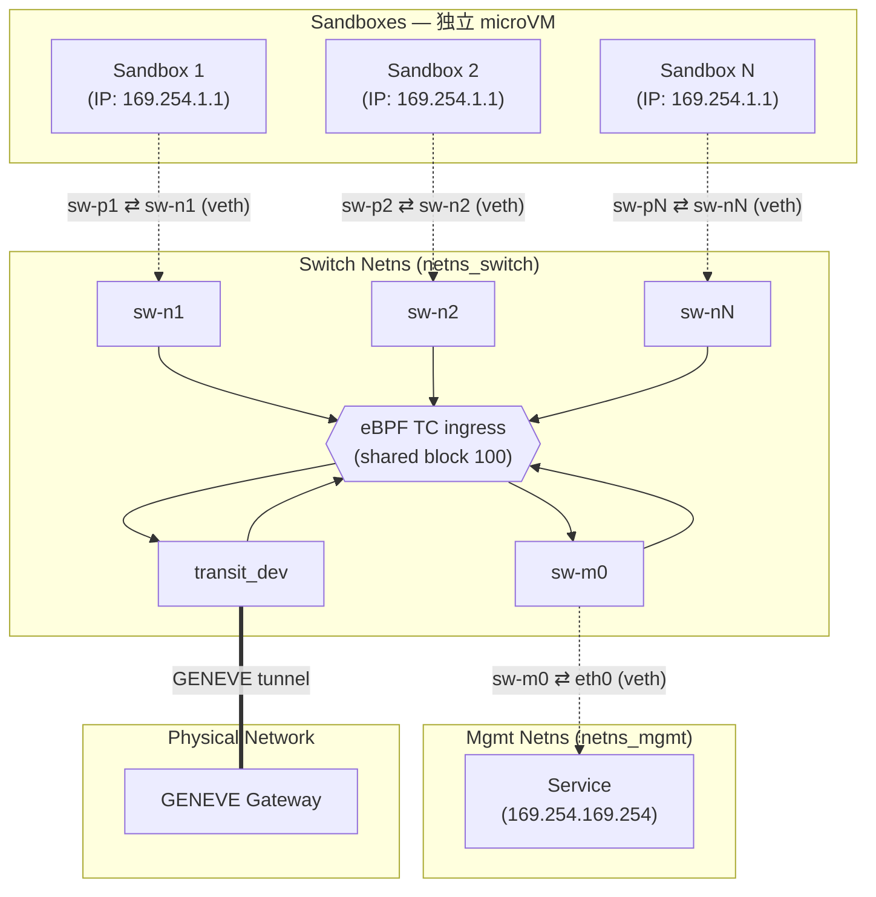
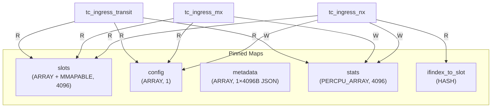

# Proposal: sandbox-vswitch — An eBPF Virtual Switch for High-Density Sandbox Workloads

| Field | Value |
| --- | --- |
| **Status** | Draft — v1, first OSS release in preparation (no SemVer tag yet) |
| **Last updated** | 2026-05-14 |
| **Go module** | `github.com/fullof-work/sandbox-vswitch` |
| **CLI binary** | `vswitch-ctl` |
| **License** | Apache-2.0 (Go / userspace); GPL-2.0 (`bpf/` kernel programs) |
| **Kernel floor** | Linux 5.10+ (BTF + TC BPF) |
| **Architectures** | linux/amd64, linux/arm64 |

> 本提案是 `sandbox-vswitch` 在首次开源发布前的总设计文档，将动机、架构、API、可靠性、性能、运维、测试整合为单一权威来源。

---

## 目录

1. [Summary](#1-summary)
2. [动机 (Motivation)](#2-动机-motivation)
3. [架构 (Architecture)](#3-架构-architecture)
4. [关键机制 (Key Mechanisms)](#4-关键机制-key-mechanisms)
5. [API 与命令行 (API & CLI)](#5-api-与命令行-api--cli)
6. [可靠性与安全 (Reliability & Security)](#6-可靠性与安全-reliability--security)
7. [性能 (Performance)](#7-性能-performance)
8. [部署与运维 (Deployment & Operations)](#8-部署与运维-deployment--operations)
9. [测试策略 (Testing)](#9-测试策略-testing)
10. [后续工作 (Future Work)](#10-后续工作-future-work)
11. [参考资料 (References)](#11-参考资料-references)
12. [附录](#12-附录-appendix)

---

## 1. Summary

`sandbox-vswitch` 是一个 **基于 eBPF/TC 的高性能虚拟交换机**，为单台宿主机上 **最多 4096 个沙箱容器/microVM** 提供互相隔离、可独立访问外部网络与管理平面的网络通道。

**核心特性：**

- **纯内核数据面**。配置完成后用户态 CLI 即退出，所有转发由 TC ingress 上的 eBPF 程序承载，没有任何 user-space 守护进程处于数据路径上。
- **沙箱间天然隔离**。eBPF 程序中根本不存在 port→port 的转发分支，沙箱无法相互可见或互访；ARP 由交换机全权代答，源 MAC 在出口被强制改写。
- **管理平面**。沙箱通过 SNAT/DNAT 访问指定的管理服务 (如 `169.254.169.254` 元数据服务)。
- **外部网络**。通过 GENEVE 隧道接入外部网络，支持 IP-over-GENEVE (默认) 和 Ether-over-GENEVE 两种封装模式；GENEVE 内层同时识别 IPv4 与 IPv6 报文 (管理平面与 `slot.inner_ip` 当前为 IPv4)。
- **并发安全**。端口槽位通过 `BPF_F_MMAPABLE` map + 用户态原子 CAS 分配，无须用户态锁；控制操作 (Start/Stop/Provision) 通过 `flock` 串行化。
- **两阶段启动**。`StartReserved` (~100 ms) 完成核心初始化并通知 systemd 就绪，`ProvisionPorts` 在后台异步创建所有端口设备。
- **veth 与 tap 双模式**。默认 veth 模式将端口设备移入沙箱 netns；tap 模式通过 `SCM_RIGHTS` 把 tap fd 直接递交给 VMM (Firecracker / Cloud Hypervisor 等)。

**适用场景：** 单宿主机高密度 microVM 平台 (典型为 Firecracker、Cloud Hypervisor、QEMU/KVM)，每个 VM 需要受控的网络出口，且整体规模不超过 4 K 个并发实例。

**不适用场景：** 跨宿主机分布式 SDN、需要细粒度 L4+ 策略的多租户控制面、需要 NAT/连接跟踪/L7 过滤的安全网关。

---

## 2. 动机 (Motivation)

### 2.1 问题陈述

为单机数千个 microVM 提供网络访问，目前主流路径有几类，但都不完全契合「**纯内核转发 + 沙箱级隔离 + 4K 级密度 + 控制面与数据面解耦**」这一组合要求：

| 方案 | 痛点 |
| --- | --- |
| Linux bridge + iptables | 每端口一份 netfilter 规则，规则膨胀；广播/ARP 泛洪在沙箱间穿越；连接跟踪开销与规模上限。 |
| OVS / OVN | 功能完备但流表查找/upcall 开销大，单机数千端口下控制面复杂度高；多了一个用户态守护进程在 fast-path 之外仍需 keep-alive。 |
| 每 VM 一对 veth + 自定义脚本 | 隔离与路由策略散落在脚本和 iptables 里，难审计；ARP 默认未隔离。 |
| 厂商专有 vSwitch | 与 Kubernetes / containerd / Firecracker 生态耦合，难以独立部署。 |

`sandbox-vswitch` 把所有的转发判定集中在一份 ~1 K 行的 eBPF C 程序里，控制面仅在 attach/detach 时操作内存映射的 BPF map，避免了上述方案的复杂度。

### 2.2 为什么选 eBPF / TC

- **零拷贝、零上下文切换** — 转发完全在内核完成，不依赖任何 user-space helper。
- **快照可恢复** — TC 程序与 BPF map 持久化在 bpffs，控制面进程崩溃或重启后数据面无中断。
- **细粒度审计** — 一份 C 程序就是完整转发逻辑，比散落在 nftables 链 + bridge fdb 中更易于推理。
- **per-CPU 统计与可观测性** — eBPF map 天然支持 per-CPU 计数器和 `bpftool` 调试。

### 2.3 设计目标 (Goals)

1. **强隔离**。沙箱间不可见 (无 port→port 转发路径)；ARP 全代答；MAC 由交换机分配并在出口改写。
2. **无状态转发**。eBPF 程序不维护连接表，所有判定基于 slot 配置 + IP/UDP 端口算术。
3. **进程生命周期与数据面解耦**。`start`/`attach`/`detach` 返回后用户态退出，转发由内核 eBPF 持续执行。
4. **并发安全**。Attach/Detach 跨进程并发不需要全局互斥，依赖 mmap+原子 CAS。
5. **可观测性**。per-port、per-direction、per-class (mgmt/transit) 流量计数；状态查询采用 Kubernetes Conditions 风格。
6. **systemd-native**。`Type=notify` 集成，`WatchdogSec` keepalive，崩溃后自动恢复。

### 2.4 非目标 (Non-Goals)

- **多 transit 设备 / 多上行**。单出口设备，外部 ECMP/绑定由上游网络处理。
- **数据面限速 / QoS**。委托给 VMM、TC qdisc 或 cgroup BPF。
- **管理平面热更新**。`--mgmt-extract` 在 `start` 时固化，变更需重建交换机。
- **>4096 端口**。`MAX_PORTS = 4096` 在 BPF C 中硬编码；提升需重新编译 + 调整切片对齐。
- **连接跟踪 / NAT 状态表 / L7 过滤**。本项目只做无状态二层/三层封装与代答。
- **跨宿主机控制面同步**。每台宿主一个独立 `vswitch-ctl` 实例。

### 2.5 典型部署形态

```
                            ┌─────────────────────┐
                            │  Mgmt / Metadata    │
                            │  169.254.169.254    │  (mgmt netns)
                            └──────────┬──────────┘
                                       │
                          ┌────────────┴────────────┐
                          │   sandbox-vswitch       │
                          │   ┌─────────────────┐   │
   microVM #1 ───── tap ──┤   │ eBPF on TC      │   │── transit_dev ── GENEVE ──▶  Gateway
   microVM #2 ──── veth ──┤   │ ingress (4096   │   │
   ...                    │   │ shared block)   │   │
   microVM #N ──── veth ──┤   └─────────────────┘   │
                          └─────────────────────────┘
```

---

## 3. 架构 (Architecture)

### 3.1 网络拓扑



设备命名约定：`<switch-name>-{p,n,m,t}<id>`，例如 `sw1-p7` (沙箱端 veth) / `sw1-n7` (交换机端 veth) / `sw1-m0` (管理端) / `sw1-t7` (持久 tap)。该前缀同时被 Go 代码和 BPF 程序解析，请勿引入新前缀。

### 3.2 网络命名空间

| Netns | 用途 | 包含的设备 |
| --- | --- | --- |
| `netns_switch` | 交换机内部网络 | `<sw>-nX`, `<sw>-mX`, `<sw>-tX` (tap 模式), `<sw>-dummy` (TC block anchor), `transit_dev` |
| `netns_ports` | 沙箱端口的初始位置 (veth 模式) | `<sw>-pX`, attach 后移入沙箱 netns |
| `netns_mgmt` | 沙箱支持网络 | 管理网卡 (如 `eth0`)；可省略 — 让 mgmt veth peer 留在调用方 / 主机 netns |
| 沙箱 netns | 沙箱容器自身 | `<sw>-pX` (从 `netns_ports` 移入) |

`<sw>-dummy` 是一个无 IP 的 dummy device，用于持有 TC shared block 上的 BPF filter 引用 (由 `StartReserved` 创建，`Stop` 删除)。所有沙箱端 veth (`<sw>-nX`) 共用 `ingress_block=100`，BPF 程序通过 `skb->ingress_ifindex` 在程序内部分派 slot。

### 3.3 数据包流向

#### 沙箱 → 管理服务 (例如 `169.254.169.254`)

```
Sandbox(src=169.254.1.1, dst=169.254.169.254)
  → sw-pX → sw-nX
  → [TC: match mgmt_cidrs[]; SNAT src→floating_ip; stats.mgmt_tx++]
  → sw-mX → eth0
  → Mgmt Service (sees src=100.100.96.X)
```

#### 管理服务 → 沙箱

```
Mgmt(src=169.254.169.254, dst=floating_ip)
  → eth0 → sw-mX
  → [TC: slot_id = dst − floating_ip_base;
         DNAT dst→inner_ip; h_dest = derived port_mac; stats.mgmt_rx++]
  → sw-nX → sw-pX → Sandbox
```

> **回程路由（mgmt netns 内）**：管理服务回包目的为 `floating_ip`，必须经 `sw-mX` 才能被 TC DNAT 回沙箱。`start` 在每个 mgmt netns 内安装的是**限定在 floating-IP 段的定向路由**，而非默认路由——固定 /20（`MaxPorts=4096`，等于 floating 段最大容量），以 `floating_ip_base` 所在 /20 为准，metric=`100+index`：
>
> ```
> ip route add <floating_ip_base>/20 dev <mgmt-dev> metric <100+index>
> ```
>
> 这样不会劫持 mgmt netns 的默认出向流量（尤其 `<netns>` 留空＝host/调用方 netns 时不污染主机默认路由）。`floating_ip_base` **不要求 /20 对齐**：不对齐时该段跨两个相邻 /20，两条都装（简化处理）；代价是相邻 /20 中未被 floating 使用的地址也会被引向 mgmt-dev（这些目的 TC 不匹配 floating 段会丢弃，属可接受副作用）。

#### 沙箱 → 外部网络 (GENEVE 封装)

```
Sandbox(dst=8.8.8.8)
  → sw-pX → sw-nX
  → [TC: no mgmt_cidrs match; GENEVE encap; inner src=port_mac, dst=transit_mac;
         stats.transit_tx++]
  → transit_dev
  → outer src=transit_ip, dst=gateway_ip; UDP src=hash(5-tuple), dst=base+slot_id; VNI
  → Gateway
```

#### 外部网络 → 沙箱 (GENEVE 解封装)

```
Gateway → GENEVE packet (UDP dst = geneve_port_base + slot_id)
  → transit_dev
  → [TC: slot_id = UDP_dst − geneve_port_base; verify outer src == transit_gateway_ip;
         verify VNI; decap; h_dest = derived port_mac; stats.transit_rx++]
  → sw-nX → sw-pX → Sandbox
```

> **关键不变量**：
> - 转发判定 key 自始至终是 `slot_id`，从入口 ifindex / floating_ip / geneve_port 三种方式中之一推导；**永远不信任沙箱报文里的源 IP / 源 MAC**。
> - `h_dest` 在解封装/转发回沙箱时被重写为派生的 port MAC，与 `<sw>-pX` 设备 MAC 精确一致，保证内核接收。

### 3.4 eBPF 程序与 Map

#### 程序挂载点

| 设备 | 挂载点 | 程序 | 功能 |
| --- | --- | --- | --- |
| `<sw>-nX` | TC ingress (shared block 100) | `tc_ingress_nx` | ARP 代答；管理流量提取 + SNAT；GENEVE 封装；统计 mgmt_tx / transit_tx。 |
| `<sw>-mX` | TC ingress | `tc_ingress_mx` | ARP 代答；地址转换 (`floating_ip` → `inner_ip`)；流量投递；统计 mgmt_rx。 |
| `transit_dev` | TC ingress | `tc_ingress_transit` | GENEVE 解封装；外层源 IP 与 VNI 校验；流量投递；统计 transit_rx。 |

#### Pinned maps (`/sys/fs/bpf/<sw>/`)



- **slots** — `BPF_MAP_TYPE_ARRAY + BPF_F_MMAPABLE`，4096 项，value `struct slot_item` (108 字节，缓存行优化：热路径字段 + 首条 `mgmt_cidr` 在 CL0，扩展 `mgmt_cidrs` 在 CL1)。`BPF_F_MMAPABLE` 允许用户态 mmap，对 `inner_ip` 字段做原子 CAS 即可完成槽位分配/释放。
- **config** — 40 字节 `switch_config`，存放 `switch_mac` / `n_ports` / `floating_ip_base` / `geneve_port_base` / `geneve_encap_eth` / `transit_nexthop` / `port_mac`。
- **metadata** — 1×4096 字节缓冲，存 **JSON 编码** 的 `SwitchMetadata` (用户态用，eBPF 程序不读)。新增字段无需重编译 BPF。
- **stats** — `BPF_MAP_TYPE_PERCPU_ARRAY`，每槽位 `slot_stats` 包含 `mgmt_{rx,tx}_{packets,bytes}` + `transit_{rx,tx}_{packets,bytes}`，从沙箱视角计数。**Attach 时清零，Detach 时保留**。
- **ifindex_to_slot** — HASH，仅 `tc_ingress_nx` 使用，把入口 ifindex 反查到 slot_id。

> **索引计算原则**：`slot_id` 由算术得到 (`dst_ip − floating_ip_base` 或 `udp_dst − geneve_port_base`)，避免 hash map 查找。`ifindex_to_slot` 仅在出方向无法用 IP/UDP 推导时使用。

### 3.5 包结构 (Go Package Layout)

```
cmd/vswitch-ctl/        CLI (Cobra). printJSON 与依赖注入函数变量留在此处。
pkg/tapfd/      (公开)     tap fd 端到端递交: PortMetadata / OpenTap / SendFd / RecvFd
pkg/vswitch/    (公开)     交换机生命周期编排 (主 Go API):
                             context.go     Interface, Open
                             lifecycle.go   Start, StartReserved, 启动期 helpers
                             provision.go   ProvisionPorts + 每槽位创建
                             stop.go        Stop, StopReleased, ReleasePorts
                             attach.go      Attach, Detach, Reserve
                             status.go      Status, Stats
                             config.go      Config, FileConfig, 解析器
                             metadata.go    SwitchMetadata
                             flock.go       ControlLock
                             exports.go     pkg/internal/bpf 重导出 (供 cmd/ 使用)
                             errors.go / types.go / deps.go
pkg/netlink/    (公开)     veth/tap/TC/批量 netlink 操作
pkg/netns/      (公开)     netns enter / move / exec
pkg/dhcp/       (公开)     内嵌 DHCP 客户端 + 服务器
pkg/daemon/     (公开)     systemd sd_notify wrapper
pkg/internal/bpf/    (私有, BPF-ABI)  cilium/ebpf 生成绑定 + 类型 + 加载器 + 错误
pkg/internal/bpfmap/ (私有, BPF-ABI)  与 BPF 结构内存布局耦合的原语:
                                       slots.go (MmappedSlots), cas.go (原子 CAS),
                                       stats.go (StatsManager), mac.go (PortMAC/MgmtMAC),
                                       types.go (BPFMap/BPFArrayMap 接口 + bpf 类型 re-export),
                                       doc.go (包概述)
bpf/                       eBPF C 源 (switch_kern.c + common.h + vmlinux.h)
examples/
  tapfd_receiver/main.go   可运行的 Go 消费端示例 (tapfd.RecvFd)
  *_test.sh                端到端测试脚本
```

**可见性规则：** 直接以字节偏移读写 BPF C 结构 (`slot_item`, `switch_config`, `slot_stats`) 的代码必须位于 `pkg/internal/` —— 这里字段偏移变动等同 ABI 变更，被 Go internal-package 规则限制只在 `pkg/*` 同级之间可见。其余 `pkg/*` 均为公开 API，外部 Go 程序可直接 import。

**依赖箭头** (无环)：

```
cmd/vswitch-ctl ──▶ pkg/vswitch ──▶ pkg/internal/bpfmap ──▶ pkg/internal/bpf
                  └─▶ pkg/tapfd
                  └─▶ pkg/{netlink, netns, dhcp, daemon}

pkg/vswitch ──▶ pkg/{netlink, netns, dhcp, daemon}
pkg/tapfd  : self-contained (stdlib + golang.org/x/sys)
```

`cmd/` 永远不直接 import `pkg/internal/*`：任何 cmd 需要的低层 helper (`Uint32ToIP`, `ParsePortKind`, `Maps`...) 都经 `pkg/vswitch/exports.go` 重导出，CLI 走的是外部嵌入者会走的同一条公开 API。

---

## 4. 关键机制 (Key Mechanisms)

### 4.1 MAC 地址派生

交换机使用统一 MAC 命名空间，所有 ARP 代答 MAC 和设备 MAC 都从一个用户提供的 `switch_mac` 派生。派生公式 `SS:SS:SS:SS:BB:LL`：

- byte0..3 = `switch_mac[0..3]`
- **byte4 (BB)** = `((switch_mac[4] ^ 0x80) & 0x80) | (id >> 8)`
- **byte5 (LL)** = `id & 0xFF`

其中 `id`：

- 沙箱端口： `id = slot_id` (`0x000`–`0xFFF`)
- 管理网卡： `id = 0x7FF0 + mgmt_idx`

**性质：** 派生 MAC 的 byte4 MSB 始终是 `switch_mac[4]` MSB 的反位 → **派生 MAC 与 `switch_mac` 不冲突**，对 `switch_mac` 没有任何输入约束。port slot_id 的高 4 位放在 byte4 低 4 位，正好支撑 4096 端口。

#### `--port-mac-addr` 模式

| 模式 | 参数 | 端口 MAC | 适用场景 |
| --- | --- | --- | --- |
| **fixed (默认)** | `--port-mac-addr=fixed` | 使用 `slot_id=1` 派生 → 所有端口共享同一 MAC | **生产快照恢复**：microVM 可无缝迁移到任意空闲 slot，无需在 VM 内重配网络。 |
| **per-port** | `--port-mac-addr=per-port` | 按 `slot_id` 派生 → 每端口唯一 MAC | 测试 / 需要在网关侧按 MAC 区分的场景。 |
| **explicit** | `--port-mac-addr=aa:bb:...:ff` | 用户指定，所有端口共享 | 特殊兼容需求 |

> Go 与 BPF 程序都按相同公式自行重算 MAC；如果改公式，**两侧必须同步**。

### 4.2 GENEVE 隧道

#### 封装模式

| 模式 | `proto_type` | 内层 | 用途 |
| --- | --- | --- | --- |
| **IP-over-GENEVE** (默认) | `ETH_P_IP` / `ETH_P_IPV6` | 裸 IP 报文 | 省 14 字节；适合 vswitch-to-vswitch。 |
| **Ether-over-GENEVE** | `ETH_P_TEB` (0x6558) | 完整以太网帧 | 兼容标准 Linux GENEVE 设备 / 网关桥接。 |

解封装通过 `geneve->proto_type` 自动识别，**无须配置**。

#### 端口方案 (per-sandbox UDP 端口)

`sandbox-vswitch` **不使用** 标准 GENEVE 端口 6081；每个沙箱独享一个 UDP 端口：

- 出方向：`UDP src = hash(inner 5-tuple)`, `UDP dst = geneve_port_base + slot_id`
- 入方向：`slot_id = UDP_dst − geneve_port_base` ← **O(1)，无 hash map 查找**

UDP 源端口用 Jenkins one-at-a-time 哈希内层 5-tuple，映射到 49152–65535，让底层网络可在外层 UDP 源端口上做 ECMP/RSS。

#### L2 寻址

- **外层以太网：** `bpf_redirect_neigh` 由内核邻居子系统解析；eBPF 程序不维护 ARP 缓存。
- **内层以太网 (仅 Ether-over-GENEVE)：**
  - 目标 MAC = `transit_mac` (`--transit-mac-addr`；未指定时使用广播)。
  - 源 MAC = 派生端口 MAC，与端口设备 MAC 一致，便于网关侧网桥进行 L2 学习。

### 4.3 端口槽位分配 (BPF_F_MMAPABLE + 原子 CAS)

并发执行 Attach 时，BPF map 的 Lookup + Update 是两次 syscall —— 经典 TOCTOU：

```
P1  Lookup(slot=1) → InnerIP=0 (空闲)
P2  Lookup(slot=1) → InnerIP=0 (空闲)
P1  Update(slot=1, X) → OK
P2  Update(slot=1, Y) → 覆盖了 P1 的写！
```

**解决：** `slots` map 启用 `BPF_F_MMAPABLE`，用户态把整个 array 内存 mmap 进进程，对 `inner_ip` 字段做 `sync/atomic.CompareAndSwapUint32`。

```
struct slot_item 在 mmap 后按 8 字节对齐 → slotSize = (108 + 7) & ~7 = 112 字节
inner_ip 偏移 = 4 字节
```

操作语义：

| 操作 | 语义 | CAS |
| --- | --- | --- |
| **Attach** | `Free → InnerIP` | `CompareAndSwap(slot.inner_ip, 0, innerIP)` |
| **Detach** | `Allocated → Free` | `CompareAndSwap(slot.inner_ip, currentIP, 0)` |
| **Reserve** | `Free → 0xFFFFFFFF` | `CompareAndSwap(slot.inner_ip, 0, 0xFFFFFFFF)` |
| **Provision 完成** | `Reserved → Free` | `CompareAndSwap(slot.inner_ip, 0xFFFFFFFF, 0)` |

任何 CAS 失败的进程会回滚部分中间状态 (例如设备移动)，确保不会留下半分配 slot。

### 4.4 控制操作互斥 (flock)

CAS 只能保证单 slot 原子；多 slot / 多资源的复合控制操作 (Start / Stop / ProvisionPorts) 通过 `flock(LOCK_EX)` 在 bpffs pin 目录 `/sys/fs/bpf/<sw>/` 上互斥：

| 操作 | flock | CAS | 说明 |
| --- | --- | --- | --- |
| Start (StartReserved) | ✓ | ✓ | flock 防止并发 Start/Stop；CAS 把所有 slot 置 Reserved。 |
| Stop (`stop`, `stop --force`) | ✓ | – | flock 防止并发 Start/Stop；读 metadata 后清理资源。内部分两步 `ReleasePorts` + `StopReleased`，`stop --force` 包含释放在用端口的第一步。 |
| ProvisionPorts | ✓ | ✓ | flock 防 Start/Stop 冲突；CAS(Reserved→Free) 逐槽释放。 |
| Attach | – | ✓ | 轻量；CAS(Free→IP)。 |
| Detach | – | ✓ | 轻量；CAS(IP→Free)。 |
| Reserve / Unreserve | – | ✓ | CAS(Free→Reserved) / CAS(Reserved→Free)。 |

### 4.5 两阶段启动 (StartReserved + ProvisionPorts)

为支持 systemd `Type=notify` 与快速冷启动，把 `start` 拆为两阶段：

#### 阶段 1 — `StartReserved` (~100 ms)

1. 配置校验。
2. 加载 eBPF objects (programs + maps)。
3. Pin maps & programs 到 bpffs。
4. 写入 `config` map 和 `metadata` map (含 transit 信息；如果 `--transit-dev-addr=auto`，DHCP 在此阶段执行)。
5. mmap `slots` map。
6. 对所有 slot 执行 `CAS(0 → 0xFFFFFFFF)` 标记为 Reserved。
7. 在 switch netns 内创建 `<sw>-dummy` 设备，持有 shared block 100 的 BPF filter 引用 (block anchor — 让 filter 在所有 port veth 都未挂载时仍存活)。
8. 创建所有管理平面 (veth + TC + mgmt netns 配置)。
9. 配置 transit 设备 (移入 switch netns、设置 MTU、IP 配置、up)。

完成后交换机已经可响应 `status`，但任何 Attach 都会失败 (CAS Free→IP 在 Reserved 状态下不匹配)。

#### 阶段 2 — `ProvisionPorts` (耗时主体)

1. `Open` 已存在交换机；从 metadata 预查询 mgmt/transit 设备信息。
2. 遍历所有 Reserved slot：
   - 创建 veth pair `<sw>-pX` / `<sw>-nX` (tap 模式则创建持久 tap `<sw>-tX`)。
   - 在 `<sw>-nX` 挂载 TC ingress (使用 shared block 100)。
   - **一次性写入** slot 所有字段 (port_ifindex、mgmt_cidrs、transit_ifindex/IP)。
   - `CAS(0xFFFFFFFF → 0)` 使该端口对 Attach 可见。
3. 幂等：Free / Allocated slot 直接跳过；Reserved slot 失败时保留状态可由 `provision --port=X` 单点修复。

#### Slot 状态机

```
inner_ip = 0x00000000          → Free        端口可分配
inner_ip = 0xFFFFFFFF          → Reserved    StartReserved 后、ProvisionPorts 前
inner_ip = 其他 (实际 IP)       → Allocated   已 attached

StartReserved          ProvisionPorts          Attach              Detach
[Free] ─CAS(0→0xFFFF)─▶ [Reserved] ─CAS(0xFFFF→0)─▶ [Free] ─CAS(0→IP)─▶ [Allocated]
                                                                          │
                                                  [Free] ◀─CAS(IP→0)──────┘

reserve --port=N [--force]:
   [Free]      ─CAS(0→0xFFFF)─▶ [Reserved]
   [Allocated] ─CAS(IP→0xFFFF)─▶ [Reserved]   (仅 --force)

attach/detach --skip-device:        CAS 不变，仅跳过设备 netns 移动 / 校验。
                                    (attach 上 --skip-device 仅 veth 模式可用，tap slot 会被拒绝)
```

#### `serve` 命令的 systemd 集成

```
serve:
  1. StartReserved()              ─── ~100ms
  2. sd_notify(READY=1)           ← systemd 视服务为就绪
  3. go ProvisionPorts()          ─── 后台异步创建端口设备
  4. main loop:
       - 定期健康检查 (Status Conditions)
       - sd_notify(WATCHDOG=1) keepalive
       - SIGTERM / SIGINT → 退出 (不影响数据面)
```

依赖于交换机的服务不需要等所有端口创建完毕，可在 `READY=1` 后即启动。端口尚未 provisioned 时 Attach 会返回 `port not provisioned`，调用方应重试。

### 4.6 端口模式：veth 与 tap

每个 slot 在 `slot_item.mode` (1 字节，offset 30) 记录端口类型 — 该字段由原 `_pad_mac[2]` 的第一字节赋意而来，第二字节仍叫 `_pad_mac` 保留对齐 (见附录 B)。BPF 数据面 **不读** 该字段 —— 它纯粹是用户态元数据，让控制面知道走哪条 attach / detach / open-port 逻辑。两种模式数据路径完全相同 (同样的 TC ingress 程序，同样按 ifindex 路由)。

|  | **veth** (默认, `mode=0`) | **tap** (`mode=1`) |
| --- | --- | --- |
| 交换机端设备 | `<sw>-nX` (veth 对端) | `<sw>-tX` (持久 tap, `TUNTAP_PERSIST=1`) |
| 沙箱端设备 | `<sw>-pX` (attach 时移入沙箱 netns) | 无 — 沙箱通过 `SCM_RIGHTS` 拿 fd |
| 需要 `--port-netns`？ | 是 | 否 (tap 留在 switch netns) |
| `provision` 行为 | 创建 veth pair + TC + 设 MAC + 写 `slot.ifindex` + `mode=0` | 创建持久 tap + TC + 设 MAC + 写 `slot.ifindex` + `mode=1` |
| `attach` 行为 | CAS + 移动 `<sw>-pX` 进沙箱 netns | **只有 CAS** (不做设备操作；如果 `slot.ifindex == 0` 直接拒绝) |
| `detach` 行为 | CAS + 把 `<sw>-pX` 移回 port netns | 只有 CAS |
| `--mode` 切换 | `provision --mode=tap` 在 veth slot 上 **先创建新模式设备 → commit 新 `slot.ifindex` → 再删旧模式设备**；slot 须为 Reserved (旧/新设备名不冲突可短暂共存) | 同上 (反方向) |
| 取 fd | n/a | `open-port` 进入 switch netns、`open(/dev/net/tun)` + `TUNSETIFF`、读 `TAPFD_SOCKET` 经 `SCM_RIGHTS` 发 fd (协议见 [tapfd.md](tapfd.md)) |
| 便捷糖 | — | `start --mode=tap` (reserve + provision all)、`attach --open-port` (经 `TAPFD_SOCKET` 合并 CAS + fd 递交) |

**核心不变量：** `attach` 和 `detach` **永远不创删设备** (两种模式都是)。设备生命周期由 `provision` (创建) 与 `stop` / `stop --force` (删除) 完全拥有；`stop --force-clean` 是损坏交换机的救场路径，**只 unpin BPF 资源、不删设备**，可能留下需手工清理的孤儿 netdev。`--skip-device` 只跳过 veth 的 netns 移动，**不会** 绕过「必须 provisioned」的前提，并且在 attach 上仅 veth 模式可用 (tap slot 会被拒绝)。

**ABI 影响：** 加入 `mode` 仅消耗了原 `_pad_mac[2]` 的第一字节；**结构大小、对齐、所有现有字段偏移完全不变**，pre-mode 数据反序列化时该字节为 0 → `mode=veth` (向后兼容)。

### 4.7 Tap fd 递交协议

sandbox-vswitch 的 tap fd 交接遵循 **[`docs/tapfd.md`](tapfd.md)** 定义的厂商无关协议（`SCM_RIGHTS` + NUL 结尾的 `key=value` 元数据 + `TAPFD_SOCKET` 获取契约）。该协议规格独立可读，第三方 VMM 据此即可对接。本节只记录 sandbox-vswitch 作为该协议一个 **provider 实现** 的具体取舍。

**元数据字段**：除协议必填的 `fd=` 外，sandbox-vswitch 发送推荐字段 `mac`（端口派生 MAC，VMM 须在 virtio-net 上 mirror —— 数据面据此识别端口）、`mtu`、`ip`（沙箱 inner IP），并附带一个 **扩展字段 `port`**（1-based slot 编号，仅供诊断 / 回查；协议消费方可忽略）：

```
port=1 mac=02:00:00:00:80:01 mtu=1500 ip=169.254.1.1 fd=1\0
```

**fd 获取（provider helper 行为）**：

- `open-port <sw> --port=N` 即 tapfd.md §5 的 helper：读环境变量 `TAPFD_SOCKET`（`fd=N` 或路径），进入 switch netns、`open(/dev/net/tun)` + `TUNSETIFF(IFF_TAP|IFF_NO_PI|IFF_VNET_HDR)`（fd 带 virtio-net header，主流 virtio VMM 的预期帧格式；vnet_hdr 是该 attach 的属性，与持久设备的创建标志无关），经该套接字发送 fd + 元数据，成功后退出码 `0`。
- `attach <sw> ... --open-port` 把 CAS 分配与 fd 交接合并为一步（同样读 `TAPFD_SOCKET`），省一次 fork/exec。

**前置校验**（在触碰 socket / tap 之前即拒绝）：slot mode 必须是 tap；slot 必须已 provisioned（`slot.ifindex != 0`）且已 attached（`innerIP != Free && != Reserved`，故 `ip` 字段总是真实 IP）。

**失败处理**：交换机未运行 → 退出码 `3`；`attach --open-port` 的 `SCM_RIGHTS` 失败时**回滚 CAS 分配**，不留半 attached slot。

**接收方**：第三方只需实现 tapfd.md §4；本仓库提供 Go 参考库 `github.com/fullof-work/sandbox-vswitch/pkg/tapfd`（`RecvFd(*net.UnixConn) (*os.File, *PortMetadata, error)`）与可运行示例 `examples/tapfd_receiver/`。多队列、扩展字段等前向兼容规则见 tapfd.md §4.3 / §8。

### 4.8 MTU 校验

GENEVE 封装会增加报文长度，必须保证 `transit_mtu >= port_mtu + encap_overhead`：

| 模式 | overhead |
| --- | --- |
| IP-over-GENEVE | ETH(14) + IP(20) + UDP(8) + GENEVE(8) = **50** |
| Ether-over-GENEVE | 上述 + 内层 ETH(14) = **64** |

`--mtu`：设置所有 port (`sw-pX`/`sw-nX`) 和 mgmt (`sw-mX`/dev) veth 的 MTU；默认 (`0`) 保留内核默认值。

`--transit-dev-mtu`：

- 未指定 — 不改 transit MTU，仅校验现值是否够。
- `auto` — 自动计算并设置 `port_mtu + encap_overhead`。
- 数字 — 设为该值，并验证够用。

**校验两条路径：**

- 快路径 — 用户给了 `--mtu`：在任何资源创建之前校验。
- 慢路径 — 用户没给 `--mtu`：等所有 veth 创建后取实际 MTU 最大值再校验。

错误示例：

```
transit device eth1 MTU 1500 is too small:
  requires at least 1564 (port MTU 1500 + Ether-over-GENEVE overhead 64)
```

### 4.9 DHCP 网关推算

`--transit-dev-addr=auto` 时，`StartReserved` 阶段在 transit 设备 up 之后做 DHCP：

- 如 DHCP 响应含 `Router Option` (3) — 直接采用。
- **若不含网关** — 自动推算子网首个可用 IP 作为网关 (例如 `192.168.1.100/24` → 网关 `192.168.1.1`)，并打印提示。

此举处理私有 DHCP 服务器仅下发 IP 不下发网关的常见情况。

---

## 5. API 与命令行 (API & CLI)

### 5.1 Go 库

外部 Go 程序可直接 import 以下公开包：

| 包 | 用途 |
| --- | --- |
| `pkg/tapfd` | tap fd 端到端递交：wire 协议 + `OpenTap` + `SendFd` + `RecvFd` |
| `pkg/vswitch` | 交换机生命周期编排：`Open`, `Start`, `StartReserved`, `Stop`, `Attach`, `Detach`, `Reserve`, `ProvisionPorts`, `Status`, `Stats` |
| `pkg/netlink` | veth/tap/TC qdisc/filter/批量操作 |
| `pkg/netns` | 命名空间进入 / 移动 / `Do` 执行 helper |
| `pkg/dhcp` | 内嵌 DHCP 客户端与服务器 |
| `pkg/daemon` | systemd `sd_notify` 简易封装 |

`pkg/internal/{bpf,bpfmap}` 故意私有 (BPF struct 字节偏移耦合)，由 Go internal-package 规则限制只在 `pkg/*` 同级可用。

最小消费端 (tap fd 接收)：

```go
package main

import (
    "log"
    "net"
    "os"

    "github.com/fullof-work/sandbox-vswitch/pkg/tapfd"
)

func main() {
    _ = os.Remove("/tmp/recv.sock")
    ln, _ := net.Listen("unix", "/tmp/recv.sock")
    defer ln.Close()

    conn, _ := ln.Accept()
    defer conn.Close()

    f, meta, err := tapfd.RecvFd(conn.(*net.UnixConn))
    if err != nil {
        log.Fatal(err)
    }
    defer f.Close()
    log.Printf("got tap fd %d for port=%d mac=%s mtu=%d ip=%s",
        f.Fd(), meta.Port, meta.MAC, meta.MTU, meta.InnerIP)
}
```

### 5.2 CLI 命令一览

| 命令 | 用途 |
| --- | --- |
| `vswitch-ctl start [switch_name] [flags]` | 创建并启动交换机 (`StartReserved` + 同步 `ProvisionPorts`)；返回后用户态退出。`switch_name` 可省略，从 `--config` 文件读。 |
| `vswitch-ctl serve [switch_name]` | systemd `Type=notify` 长驻：`StartReserved` → `sd_notify(READY=1)` → 后台 `ProvisionPorts` → 主循环 + watchdog keepalive。 |
| `vswitch-ctl stop <name> [--force] [--force-clean]` | 卸载 eBPF、删除 pinned maps、删除 veth/tap、把 `transit_dev` 还回原 netns。`--force`：先释放所有 in-use 端口再 stop (两轮清理)。`--force-clean`：损坏交换机救场 — 仅 unpin，跳过设备清理。 |
| `vswitch-ctl attach <name>` | 分配端口 (CAS Free→IP)；可选移动端口设备进沙箱 netns；支持 `--skip-device` (veth-only) / `--open-port` (tap：合并 fd 递交，经 `TAPFD_SOCKET`)。 |
| `vswitch-ctl detach <name> --port=X` | 释放端口 (CAS IP→Free)；可选把端口设备移回 port netns；支持 `--skip-device`。 |
| `vswitch-ctl reserve <name> --port=N [--force]` | 把端口标记为 Reserved，阻止后续 Attach (升级 / 排空时)。`--force` 允许覆盖 Allocated → Reserved。 |
| `vswitch-ctl provision <name>` | 为 Reserved slot 创建端口设备；支持单点修复 (`--port=X`) 与批量。 |
| `vswitch-ctl open-port <name>` | 进入 switch netns 打开 tap 设备，经环境变量 `TAPFD_SOCKET`（`fd=N` 或路径）以 SCM_RIGHTS 递交 fd 给 VMM（协议见 [tapfd.md](tapfd.md)）。 |
| `vswitch-ctl status <name>` | 输出交换机 JSON 状态；`--ready` 退出码 0=Ready / 3=NotExist / 4=NotReady (Conditions: Ready, PortDevicesReady, MgmtDevicesReady, TransitDeviceReady；`start --reserved` 后 / ProvisionPorts 未完成时还会出现 `PortReserved`)。 |
| `vswitch-ctl stats <name> [--port=X...]` | per-port 流量计数 (mgmt/transit × rx/tx × packets/bytes)。 |
| `vswitch-ctl show slots <name> [slot_id]` | dump slot 表为 JSON。 |
| `vswitch-ctl show config <name>` | dump in-kernel `switch_config` 为 JSON。 |
| `vswitch-ctl dhcp request <iface>` | 在指定设备上跑一次 DHCP (调试用)。 |
| `vswitch-ctl dhcp serve <flags>` | 内嵌 DHCP 服务器 (供 mgmt 平面或测试场景)。 |

完整参数清单见 [附录 A](#附录-a完整-cli-参数)。所有命令默认输出 JSON。

---

## 6. 可靠性与安全 (Reliability & Security)

### 6.1 威胁模型

**所在层级：** `sandbox-vswitch` 是 microVM 之外的 **纵深防御** 层 —— microVM hypervisor 仍是首要安全边界。对沙箱代码假设为半信任 (可能恶意但被 VMM 约束)。

**主要威胁：**

| # | 威胁 | 缓解 |
| --- | --- | --- |
| T1 | 沙箱伪造源 IP / MAC 绕过隔离 | eBPF 路由判定仅基于 `slot_id` (从 ifindex / floating_ip / geneve_port 推导)；MAC 在出口被改写。 |
| T2 | 沙箱直接访问其他沙箱 | eBPF 程序无 port→port 分支，仅 port→mgmt 与 port→transit。 |
| T3 | 沙箱伪造 GENEVE 流量 | transit decap 验证外层源 IP == `transit_gateway_ip`，并校验 VNI；其它来源直接丢弃。 |
| T4 | ARP 广播泄漏 | 所有 ARP 由交换机代答；广播帧在 ingress 即被消费，从不出端口。 |
| T5 | 控制面进程崩溃 → 数据面瘫痪 | 数据面 (TC filter + pinned maps + 内核设备) 与进程解耦；`serve` `Restart=on-failure` 可重启并通过 bpffs 重新挂接。 |
| T6 | 并发 Attach 竞态分配同一 slot | mmap + 原子 CAS：失败者退回；不需要全局锁。 |
| T7 | 沙箱 netns 被外部删除 → slot 永久泄漏 | 上限受 `MAX_PORTS=4096` 约束；后续工作 (F1) 规划新增孤儿 slot 扫描 / 回收子命令。当前可用 `stop --force` 整体重置后重启交换机。 |

### 6.2 隔离不变量

1. **No port-to-port path.** eBPF 程序源码可静态审计 — 不存在从 `<sw>-nX` 转发到另一个 `<sw>-nY` 的分支。
2. **ARP 代答完全由交换机执行。** 任何 ARP request 在 `<sw>-nX` ingress 上被消费，由 BPF 程序构造 ARP reply 直接 redirect 回端口，不会到达其它端口。
3. **源 MAC 强制改写。** 转发出口的源 MAC 总是 `switch_mac` 或派生 MAC，沙箱发的源 MAC 在数据面被忽略。
4. **入端口受限。** transit decap 程序拒绝任何非 `transit_gateway_ip` 来源 + VNI 不匹配的 GENEVE 包。
5. **管理流量地址转换。** 出方向 SNAT 源到 `floating_ip` (沙箱实际身份)，入方向 DNAT 目的到 `inner_ip`；管理服务永远看不到沙箱原始 IP。

### 6.3 数据面访问检查

每个程序入口都有显式边界检查 (静态 verifier-friendly)：

- ETH header 长度；
- IP header `ihl == 5` (IPv4) 或 IPv6 fixed header；
- decap 长度 `< skb->len`；
- slot 有效性 (`inner_ip != 0`, `ifindex != 0`)；
- `slot_id < n_ports`；
- transit decap：outer src == `transit_gateway_ip`、VNI 匹配。

### 6.4 资源生命周期 / 进程重启

| 资源 | 持久化机制 | 进程崩溃后状态 |
| --- | --- | --- |
| BPF 程序 | TC filter refcount | 保留 (filter 引用) |
| BPF maps | bpffs pin `/sys/fs/bpf/<sw>/` | 保留 |
| veth / tap / dummy / transit | 内核 netns | 保留 |
| flock | 进程退出时释放 | 自动释放，允许下次 start/stop 进入 |

`serve` 崩溃 → systemd `Restart=on-failure` → 新进程 `Open(switchName)` 通过 bpffs 重新挂接现有 maps + programs → `ProvisionPorts` 跳过已 Free/Allocated 的 slot → 接着干。

### 6.5 所需权限

| 操作 | 所需 capabilities | 原因 |
| --- | --- | --- |
| start / serve | `CAP_SYS_ADMIN` + `CAP_NET_ADMIN` | 加载 BPF、Pin maps、创建 netns/veth、配置 TC |
| attach / detach | `CAP_SYS_ADMIN` + `CAP_NET_ADMIN` | mmap BPF map、跨 netns 移动设备 |
| stop | `CAP_NET_ADMIN` + (`CAP_SYS_ADMIN` 或 `CAP_BPF`) | 卸载 TC、删除 veth、unpin bpffs (BPF 操作需要 CAP_SYS_ADMIN / CAP_BPF) |
| status / stats / show | `CAP_SYS_ADMIN` | 通过 pin fd 读 BPF map |

Linux 5.8+ 上 `CAP_BPF` 可替代部分 `CAP_SYS_ADMIN`；TC 与 netns 操作仍需 `CAP_NET_ADMIN`。

### 6.6 已知风险与限制

| # | 风险 | 当前处理 |
| --- | --- | --- |
| R1 | Attach 中 CAS 完成到 transit 字段写入之间存在 ~1µs 窗口，期间命中入站 GENEVE 可能丢包 | 数量级一手计；攻击不可控；可由 VMM 重传弥补。 |
| R2 | 沙箱 netns 在 detach 前被外部销毁 → slot 泄漏 (端口设备消失但 slot 状态保留) | 上限 4096，运营自检；后续工作 (F1): 新增孤儿 slot 扫描 / 回收能力。当前 `stop --force` / `stop --force-clean` 仅在 stop 时整体清理，不做单 slot 检测。 |
| R3 | transit_dev 物理故障 | 上游 ECMP / 网卡绑定；不在本项目处理。**启动安全检查**：transit 设备进入 `start` 时必须为 DOWN — 防止接管在用网卡；UP 状态会被直接拒绝。 |
| R4 | `MAX_PORTS = 4096` 上限 | 需重编译 BPF；对 4K 上限内的目标场景足够。 |
| R5 | 数据面无限速 / QoS | 委托给 VMM / TC qdisc / cgroup BPF。 |
| R6 | `__u64` 统计计数器理论溢出 | 在 100 Gbps + 64B 持续打流下需要约 93 年。 |
| R7 | mgmt CIDR 配置错误 (掩码过宽) | 建议每路由 /32；每 slot 最多 3 条 (`MAX_MGMT_CIDR_PER_SLOT = 3`)。 |
| R8 | 单一安全边界假设错误 | sandbox-vswitch **不是** 唯一边界 — microVM 隔离仍为首层。 |

---

## 7. 性能 (Performance)

### 7.1 参考基准 (Reference, WSL2 Linux 5.15)

> ⚠️ 以下数字为 **参考量级**，测得环境为 WSL2 + Linux 5.15，2 端口拓扑。生产环境会因 CPU、网卡、内核版本、负载形态有显著差异。

| 指标 | Baseline (裸 veth) | GENEVE 路径 (vswitch-ctl) | 相对开销 |
| --- | --- | --- | --- |
| TCP 吞吐 (单流) | ~110 Gbps | ~55 Gbps | ~50% |
| UDP 64B PPS | ~1100 Kpps | ~250 Kpps | ~77% |
| RTT (端到端) | — | ~0.09 ms | — |
| `tc_ingress_nx` 单次执行 | — | ~110 ns | — |
| `tc_ingress_transit` 单次执行 | — | ~110 ns | — |

PPS 下降 (~77%) 大于带宽下降 (~50%) → 瓶颈是 **每包固定成本** (BPF + veth + GENEVE 各阶段)，而非带宽。对大 TCP 流，GRO/GSO 摊薄了每包成本；对小包 / 突发，BPF 与 GENEVE encap/decap 主导耗时。

### 7.2 控制面基准 (128 ports, WSL2 Linux 5.15)

| 阶段 | 测量值 | 备注 |
| --- | --- | --- |
| Start (经 4-阶段批量优化) | **8.71 s** (-48.4% vs 16.87 s) | netns 切换数从 ~24576 降至 3。 |
| StartReserved (单独) | **~100 ms** | 仅 BPF 加载 + map 创建，无 RTNL。 |
| ProvisionPorts (128 ports) | ~8.7 s | 主要瓶颈：TC attach 占剩余时间 97% (受内核 RTNL 全局锁约束)。 |
| Stop (128 ports) | ~18 s | ~70 ms / pair (无 BPF) — ~145 ms / pair (含 BPF filter 卸载)；RTNL 串行无法绕过。 |
| Stop (256 ports) | ~35 s | 线性增长。 |

**异步启动时间线** (128 ports)：

```
t=0 ms      vswitch-ctl serve 进入
t=100 ms    sd_notify READY=1                 ← 依赖服务可启动
t=200 ms    ~首个端口可 attach (Free)
t=8700 ms   全部 128 个端口 Free
```

### 7.3 优化路线图

| ID | 标题 | 预估收益 | 状态 |
| --- | --- | --- | --- |
| **B1** | Start 时 pin gateway MAC，用 `bpf_redirect` 替换 `bpf_redirect_neigh` | -20~40 ns/pkt (BPF 执行的 20–35%)；顺带修复 cold-ARP 首包丢失 | **计划** (Future Work [F2](#10-后续工作-future-work)) |
| B2 | transit decap 用 XDP 替代 TC ingress | 取决于驱动；XDP_DROP/PASS 比 TC 快约 50% | 调研 |
| B3 | `BPF_F_ADJ_ROOM_NO_CSUM_RESET` on decap | 减少不必要 checksum 重算 | 调研 |
| B4 | 单队列底层网卡上启用 RPS | 多核 spread | 文档 |
| B5–B9 | `ifindex_to_slot` ARRAY 化 / 条件 pull_data / tail-call / mgmt_cidr cache-line / batch stats lookup | 低单点收益 (部分已做) | — |

---

## 8. 部署与运维 (Deployment & Operations)

### 8.1 构建与安装

```bash
make build                  # 默认；产出 bin/<arch>/vswitch-ctl + bin/vswitch-ctl 软链 (无需 clang，仓库自带预生成 .o)
make build TARGET_ARCH=aarch64  # 交叉编译 (纯 Go，无需交叉工具链)；别名 amd64 / arm64
make release                # 打包 build/dist/sandbox-vswitch-<ver>-linux-<arch>.tar.gz
make generate               # 仅修改 bpf/*.c 时；需要 clang 12+
make test                   # 单元测试
sudo make test-integration  # 集成 (需 root + BPF 内核)
sudo make test-e2e          # 端到端 (examples/*_test.sh all)
sudo make bench             # 性能基准 (需 root + iperf3)
make lint / make fmt        # go vet / go fmt + clang-format
make vmlinux                # 重新生成 bpf/vmlinux.h (需 bpftool)
```

### 8.2 系统要求

- Linux **5.10+** (BTF + TC BPF)。
- BTF 可访问于 `/sys/kernel/btf/vmlinux`。
- bpffs 挂载在 `/sys/fs/bpf` (`mount -t bpf bpf /sys/fs/bpf`)。
- 运行时：root 或 `CAP_SYS_ADMIN + CAP_NET_ADMIN`。
- 构建：**Go 1.24+**；重新生成 eBPF 字节码额外需 **Clang/LLVM 12+**。

### 8.3 systemd 集成

仓库 `dist/` 提供：

| 模板 | 安装位置 | 用途 |
| --- | --- | --- |
| `dist/sandbox-vswitch.service` | `/etc/systemd/system/` | `Type=notify` 单元 |
| `dist/sandbox-vswitch.conf` | `/etc/sandbox-vswitch/switch.conf` | EnvironmentFile (shell 变量格式) |
| `dist/NetworkManager-sandbox.conf` | `/usr/lib/systemd/system/NetworkManager.service.d/sandbox-vswitch.conf` | 可选：让 NetworkManager 在 vswitch-ctl 之后启动 |

service unit 关键字段 (摘自 `dist/sandbox-vswitch.service`)：

```ini
[Service]
Type=notify
NotifyAccess=main
WatchdogSec=60
Restart=on-failure
EnvironmentFile=/etc/sandbox-vswitch/switch.conf

# 1) 确保所需 netns 存在 (幂等)
ExecStartPre=/bin/bash -c 'for ns in ${SWITCH_NETNS} ${PORT_NETNS} ${MGMT_NETNS}; do \
                            ip netns add $$ns 2>/dev/null || true; done'

# 2) 若已 start 过则跳过；否则等待 transit_dev 在宿主 netns 出现 (最多 120 s)
ExecStartPre=/bin/bash -c 'if ! /usr/sbin/vswitch-ctl status ${SWITCH_NAME} && [ -n "${TRANSIT_DEV}" ]; then \
                            for i in $(seq 1 120); do \
                              ip link show "${TRANSIT_DEV}" &>/dev/null && exit 0; sleep 1; \
                            done; exit 1; \
                          fi'

ExecStart=/usr/sbin/vswitch-ctl serve ${SWITCH_NAME} ...
```

两个 `ExecStartPre`：第一个创建命名空间 (幂等)，第二个在交换机尚未存在时等待 `${TRANSIT_DEV}` 出现 (例如等内核驱动加载完毕)。完整内容见仓库 `dist/sandbox-vswitch.service`。

**Host-netns 管理平面：** 若把 `MGMT_NETNS=` 留空 (例如 mgmt / metadata service 直接跑在 host 上)，生成的 `--mgmt-extract=:mgmt0:${MGMT_SERVICE_ROUTES}` 会让 mgmt veth peer 留在调用方 (即 service 所在的) netns，第一个 `ExecStartPre` 的 `for ns in …` 循环也会因 bash 词分裂自动跳过空值，无需手动创建 mgmt netns。

### 8.4 首次启动流程

1. 识别 transit 网卡 (`ip -br link`)，编辑 `/etc/sandbox-vswitch/switch.conf` (设置 `TRANSIT_DEV` / `TRANSIT_DEV_ADDR` 等)。
2. 确保 transit 处于 DOWN：`ip link set "$TRANSIT_DEV" down` (service 会把它移入 switch netns)。
3. `sudo systemctl start vswitch-ctl`。
4. 验证：
   - `systemctl status vswitch-ctl` 显示 active (notified)。
   - `vswitch-ctl status sw0 --ready` 退出 0 (Ready)。
   - `ip netns list` 显示三个命名空间。
5. `sudo systemctl enable vswitch-ctl`。

### 8.5 故障排除

| 症状 | 原因 / 处理 |
| --- | --- |
| `transit device not found` | 配置文件中 `TRANSIT_DEV` 与 `ip link` 不一致；纠正后重启。 |
| `transit device eth1 must be DOWN before use` | 安全检查；`ip link set eth1 down` 后重启。 |
| `failed to pin maps: ...bpffs not mounted` | `mount -t bpf bpf /sys/fs/bpf`，并加入 `/etc/fstab`。 |
| `switch already exists` | 上次未干净 stop；`sudo vswitch-ctl stop <name>` 或最后手段 `sudo rm -rf /sys/fs/bpf/<name>`。 |
| 升级后 ABI 不兼容 | `sudo rm -rf /sys/fs/bpf/<name>` 后重启 service。 |
| `port not provisioned` | 等待 `ProvisionPorts` 完成 (`status` 中 `PortDevicesReady` 转 True) 后重试。 |
| Attach 报 `port not attached` (open-port) | 先 attach 再 open-port；open-port 要求 slot 已分配。 |

---

## 9. 测试策略 (Testing)

### 9.1 测试分层

| 层 | 文件 | 权限 | 内容 |
| --- | --- | --- | --- |
| 单元 (Unit) | `*_test.go` (非 `_integration_` 后缀) | 普通用户 | 纯逻辑；mock 注入 BPF / netlink。 |
| 集成 (Integration) | `*_integration_test.go` | root | 真实 eBPF 加载、netlink 操作；`//go:build integration` + `-tags=integration -exec sudo`。 |
| 端到端 (E2E) | `examples/*_test.sh` | root | 完整网络拓扑 + 真实包；`setup`/`test`/`teardown`/`all` 子命令。 |
| 基准 (Bench) | `examples/perf_bench.sh` | root + iperf3 | 不同端口密度 (2/16/128/1024) 下的吞吐/PPS/RTT。 |

### 9.2 eBPF 三层验证

1. **结构对齐** — `pkg/internal/bpf/*_integration_test.go` 校验 Go ↔ BPF C 结构内存布局 (偏移、大小、对齐)。
2. **`BPF_PROG_TEST_RUN`** — `pkg/internal/bpf/prog_integration_test.go` 直接执行 eBPF 程序，喂入手工构造的报文，断言返回 action 与输出字节。
3. **真实拓扑** — `examples/*_test.sh` 在宿主上建立完整网络拓扑，用真实 ping/iperf/netperf 验证转发路径。

**E2E 套件：**

| 脚本 | 覆盖场景 |
| --- | --- |
| `mgmt_isolation_test.sh` | 管理平面连通 + 沙箱间隔离不变量 |
| `geneve_eth_test.sh` | Ether-over-GENEVE 经网关桥接 |
| `geneve_ip_test.sh` | IP-over-GENEVE 交换机对交换机 |
| `provision_test.sh` | 两阶段启动 + Reserved 修复 + show |
| `tap_test.sh` | tap 模式、`open-port`、`attach --open-port`、模式切换 |

> `BPF_PROG_TEST_RUN` 不易设置 `skb->ingress_ifindex`，对 `tc_ingress_nx` 的测试通过 `ifindex=0 → slot_id` 的 map 项绕过。

---

## 10. 后续工作 (Future Work)

| ID | 主题 | 说明 |
| --- | --- | --- |
| F1 | 孤儿 slot 扫描 / 回收 | 新增子命令 (暂定 `gc` / `reap`)：检测端口设备已消失但 slot 仍 Allocated 的孤儿条目，自动 CAS 回 Free 并清理资源 (R2 缓解)。 |
| F2 | 优化 [B1](#73-优化路线图) — pin gateway MAC | 用 `bpf_redirect` 替换 `bpf_redirect_neigh`；预计 -20–40 ns/pkt。 |
| F3 | XDP transit decap | 视驱动支持评估收益。 |
| F4 | `MAX_PORTS` 配置化 | 编译期常量改为可配置 (受限于 BPF map 大小限制)。 |
| F5 | Prometheus 导出 | 把 `stats` 转为 Prometheus 指标 (与 `serve` 进程绑定)。 |
| F6 | 多接收端 multicast / port mirroring | 用 `bpf_clone_redirect` 支持轻量 mirror，便于抓包/审计。 |
| F7 | Cilium-style 健康检查端点 | `serve` 暴露 HTTP `/healthz` + Prometheus `/metrics`。 |
| F8 | 多队列 tap (multi-queue virtio-net) | `fd` 字段已为此预留；wire 协议向前兼容。 |
| F9 | 沙箱出口流量限速 | 评估 cgroup BPF / TBF qdisc 集成路径。 |
| F10 | Rust / C 接收端 SDK | `pkg/tapfd` wire protocol 已稳定，按需提供其它语言绑定。 |

---

## 11. 参考资料 (References)

- **Linux TC BPF**：[TC eBPF programs (cilium docs)](https://docs.cilium.io/en/stable/bpf/)
- **GENEVE (RFC 8926)**：Generic Network Virtualization Encapsulation.
- **BPF_F_MMAPABLE**：[bpf: add mmap() support for BPF_MAP_TYPE_ARRAY (kernel commit fc9702273e2e)](https://git.kernel.org/torvalds/c/fc9702273e2e).
- **SCM_RIGHTS**：unix(7), cmsg(3) — file descriptor passing over Unix sockets.
- **systemd `Type=notify`**：[sd_notify(3)](https://www.freedesktop.org/software/systemd/man/sd_notify.html).
- **cilium/ebpf**：本项目使用的 Go eBPF 库，`go.mod` 中固定版本。
- **vishvananda/netlink / netns**：本项目使用的 Go netlink/netns 绑定。

---

## 12. 附录 (Appendix)

### 附录 A：完整 CLI 参数

#### `start [switch_name]` / `serve [switch_name]`

| 参数 | 必填 | 说明 |
| --- | --- | --- |
| `--netns` | ✓ | 交换机内部 netns (必须已存在) |
| `--mac-addr` | ✓ | 虚拟 MAC base，前 4 字节用于派生所有派生 MAC |
| `--port-netns` | ✓ (veth) | 端口设备初始 netns；tap 模式或 `--reserved` 下可省 |
| `--ports` | ✓ | 端口数 (1–4096) |
| `--floating-ip-base` | ✓ | floating IP 基地址 (slot_id=0 起递增) |
| `--mgmt-extract` | – | mgmt 平面定义 `<netns>:<dev>:<route1>,<route2>,...`；可重复 (最多 3，见 `MAX_MGMT_CIDR_PER_SLOT`)。`<netns>` 可留空 (`:<dev>:<routes>`) 让 mgmt veth peer 留在调用方 / 主机 netns。 |
| `--transit-dev` | – | 外部上行设备 (start 时从调用 netns 移入 switch netns)；必须 **DOWN** |
| `--transit-dev-addr` | – | `<ip>/<prefix>:<nexthop>` 或 `auto` (DHCP) |
| `--transit-dev-mtu` | – | `auto` 或具体数值；默认不修改 |
| `--geneve-port-base` | – | GENEVE UDP 端口基值 (例如 50000) |
| `--geneve-encap-eth` | – | 启用 Ether-over-GENEVE (默认 IP-over-GENEVE) |
| `--mtu` | – | 设置所有 port / mgmt veth MTU |
| `--port-mac-addr` | – | `fixed` (默认) / `per-port` / `aa:bb:cc:dd:ee:ff` |
| `--mode` | – | `veth` (默认) 或 `tap`：(a) 非 `--reserved` 时控制一次性 reserve + provision-all 的 mode；(b) 配合 `--reserved` 时仅作为验证提示 (例如 `--mode=tap` 让 `--port-netns` 真正可省)，不持久化 |
| `--reserved` | – | 仅做 `StartReserved`，不自动 ProvisionPorts；`--port-netns` 变为可选。**注意**：当前 port-netns 由 `start` 写入交换机配置，`provision` 无独立 flag 覆盖 — 若 start 时省了 port-netns，后续只能 `provision --mode=tap`；想做 veth 端口请在 start 时仍配上 `--port-netns`。 |
| `--config` | – | 从文件读取参数 (允许 `start [switch_name]` 省略 positional) |

#### `attach <switch_name>`

| 参数 | 说明 |
| --- | --- |
| `--port=N` | 指定槽位 (省略则自动分配) |
| `--to-netns=NS` | 移动端口设备进目标 netns (veth 模式) |
| `--inner-ip=IP` | 沙箱内部 IP (必填) |
| `--transit-gateway-ip=IP` | GENEVE 外层目标 IP |
| `--transit-geneve-vni=N` | GENEVE VNI |
| `--transit-mac-addr=MAC` | 内层目标 MAC (省略则使用广播) |
| `--skip-device` | 跳过设备 netns 移动；仅做 CAS。**仅 veth 模式可用**，对 tap slot 会被拒绝。 |
| `--open-port` | tap 模式：CAS 成功后经环境变量 `TAPFD_SOCKET` 立即递交 fd；SCM_RIGHTS 失败时回滚 (`detach --skip-device`)。 |

> 把端口标记为 Reserved 是 `reserve` 命令的职责，不是 attach 的 flag — 见下方 `reserve` 表。

#### `detach <switch_name> --port=N`

| 参数 | 说明 |
| --- | --- |
| `--from-netns=NS` | 端口当前所在的沙箱 netns (省略则验证仍在 port netns) |
| `--skip-device` | 跳过设备移动 / 验证 (veth / tap 均可) |

#### `reserve <switch_name>`

| 参数 | 必填 | 说明 |
| --- | --- | --- |
| `--port=N` | ✓ | 要预留的槽位编号 (1-based) |
| `--force` | – | 允许覆盖 Allocated → Reserved (默认仅 Free → Reserved) |

#### `provision <switch_name>`

| 参数 | 说明 |
| --- | --- |
| `--port=N` | 仅修复指定槽位 (单点修复)；与 `--count` 互斥 |
| `--count=N` | 限制本次创建的设备数 (0 = 全部)；与 `--port` 互斥 |
| `--mode=veth\|tap` | 模式 (默认 `veth`)；mode switch 时 slot 须为 Reserved |

#### `stop <switch_name>`

| 参数 | 说明 |
| --- | --- |
| `--force` | 先释放所有 in-use 端口再执行 stop (两轮清理) — 用于强制关停 |
| `--force-clean` | 损坏交换机救场：仅 unpin BPF 资源，跳过设备清理。可能留下孤儿 netdev，需手工处理。 |

#### `status <switch_name>`

| 参数 | 说明 |
| --- | --- |
| `--ready` | 不打 JSON；按 Conditions 退出 (0=Ready, 3=NotExist, 4=NotReady) |

#### `stats <switch_name>`

| 参数 | 说明 |
| --- | --- |
| `--port=N` | 可重复；省略则列出所有已分配端口 |

#### `open-port <switch_name>`

| 参数 | 说明 |
| --- | --- |
| `--port=N` | 槽位编号 |

目标套接字经环境变量 `TAPFD_SOCKET`（`fd=N` 或路径）指定，协议见 [tapfd.md](tapfd.md) §5.3。

### 附录 B：BPF struct 概要

```c
struct slot_item {                          // 108 字节，cache-line 优化
    // ── Cache line 0 (热路径) ────────────────────────────────────
    __u32 ifindex;                          // offset  0
    __u32 inner_ip;                         // offset  4  — 0=Free, 0xFFFFFFFF=Reserved, 其他=Allocated
    __u32 transit_ifindex;                  // offset  8
    __u32 transit_ip;                       // offset 12
    __u32 transit_gateway_ip;               // offset 16
    __u32 transit_geneve_vni;               // offset 20
    __u8  transit_mac[6];                   // offset 24
    __u8  mode;                             // offset 30 — 0=veth, 1=tap
    __u8  _pad_mac;                         // offset 31
    __u32 mgmt_cidr_count;                  // offset 32
    struct mgmt_cidr mgmt_cidrs_0;          // offset 36 (20B) — 内联第一条 (热路径)
    __u8  _pad_cl0[8];                      // offset 56     — 填充到 cache line 0
    // ── Cache line 1 (冷路径) ────────────────────────────────────
    struct mgmt_cidr mgmt_cidrs_ext[MAX_MGMT_CIDR_EXT]; // offset 64 (40B) — MAX_MGMT_CIDR_PER_SLOT − 1
    __u8  _pad_cl1[4];                      // offset 104
};                                          // Total: 108 bytes (mmap 后按 8 对齐 → 112 字节/槽 → 4096 槽 ≈ 448 KB)

struct switch_config {                   // 40 字节
    __u8  switch_mac[6];
    __u16 _pad;
    __u32 n_ports;
    __u32 floating_ip_base;
    __u32 geneve_port_base;
    __u8  geneve_encap_eth;
    __u8  _pad3[3];
    __u32 transit_nexthop;
    __u8  port_mac[6];                   // 全零 → 派生；非零 → 固定
    __u8  _pad4[2];
    __u8  _pad5[4];
};

struct slot_stats {                      // per-CPU
    __u64 mgmt_rx_packets, mgmt_rx_bytes;
    __u64 mgmt_tx_packets, mgmt_tx_bytes;
    __u64 transit_rx_packets, transit_rx_bytes;
    __u64 transit_tx_packets, transit_tx_bytes;
};
```

### 附录 C：JSON 输出示例

`start` 输出：

```json
{
  "switch": "sw1",
  "switch_netns": "netns_switch",
  "switch_maps": {
    "slots":    "/sys/fs/bpf/sw1/slots",
    "config":   "/sys/fs/bpf/sw1/config",
    "stats":    "/sys/fs/bpf/sw1/stats",
    "metadata": "/sys/fs/bpf/sw1/metadata"
  },
  "port_netns": "netns_ports",
  "ports": 4096, "ports_used": 0, "ports_available": 4096,
  "floating_ip_base": "100.100.96.0",
  "mgmt_planes": [
    { "index": 0, "mgmt_netns": "netns_mgmt", "mgmt_dev": "eth0",
      "service_routes": ["169.254.169.254/32"], "return_route_metric": 100 }
  ],
  "transit_type": "overlay-geneve",
  "transit_dev": "eth1",
  "transit_dev_ip": "10.200.12.3",
  "geneve_port_base": 50000
}
```

`attach` 输出：

```json
{
  "port": 4, "port_dev": "sw1-p4", "port_netns": "sandbox_ns_4",
  "port_mac": "02:00:00:00:80:01",
  "inner_ip": "169.254.1.1",
  "floating_ip": "100.100.96.3",
  "transit_type": "overlay-geneve",
  "geneve_port": 50003,
  "transit_gateway_ip": "10.200.12.1",
  "transit_geneve_vni": 1004
}
```

`attach --open-port` 输出 (合并形式)：

```json
{
  "port": 4, "port_dev": "sw1-t4",
  "port_mac": "02:00:00:00:80:01",
  "inner_ip": "169.254.4.1", "mtu": 1500,
  "tap_sent_to": "/tmp/recv.sock"
}
```

`status` 输出 (普通运行)：

```json
{
  "switch": "sw1",
  "state": "running",
  "conditions": [
    { "type": "Ready",              "status": "True" },
    { "type": "PortDevicesReady",   "status": "True" },
    { "type": "MgmtDevicesReady",   "status": "True" },
    { "type": "TransitDeviceReady", "status": "True" }
  ],
  "ports": 4096, "ports_used": 128, "ports_available": 3968,
  "mgmt_planes": [{ "index": 0, "mgmt_netns": "netns_mgmt", "mgmt_dev": "eth0",
                    "service_routes": ["169.254.169.254/32"] }],
  "transit_dev": "eth1", "transit_dev_ip": "10.200.12.3"
}
```

ProvisionPorts 完成前 (或 `start --reserved` 启动后)，会多一条 `PortReserved` 条件：

```json
"conditions": [
  { "type": "Ready",              "status": "False", "reason": "PortsReserved" },
  { "type": "PortReserved",       "status": "True",
    "message": "all 4096 ports still in Reserved state (ProvisionPorts pending)" },
  ...
]
```

`stats` 输出：

```json
{
  "switch": "sw1",
  "ports": [
    { "port": 1,
      "mgmt_rx_packets": 42,  "mgmt_rx_bytes": 3528,
      "mgmt_tx_packets": 42,  "mgmt_tx_bytes": 3528,
      "transit_rx_packets": 100, "transit_rx_bytes": 8400,
      "transit_tx_packets": 100, "transit_tx_bytes": 8400 }
  ]
}
```

