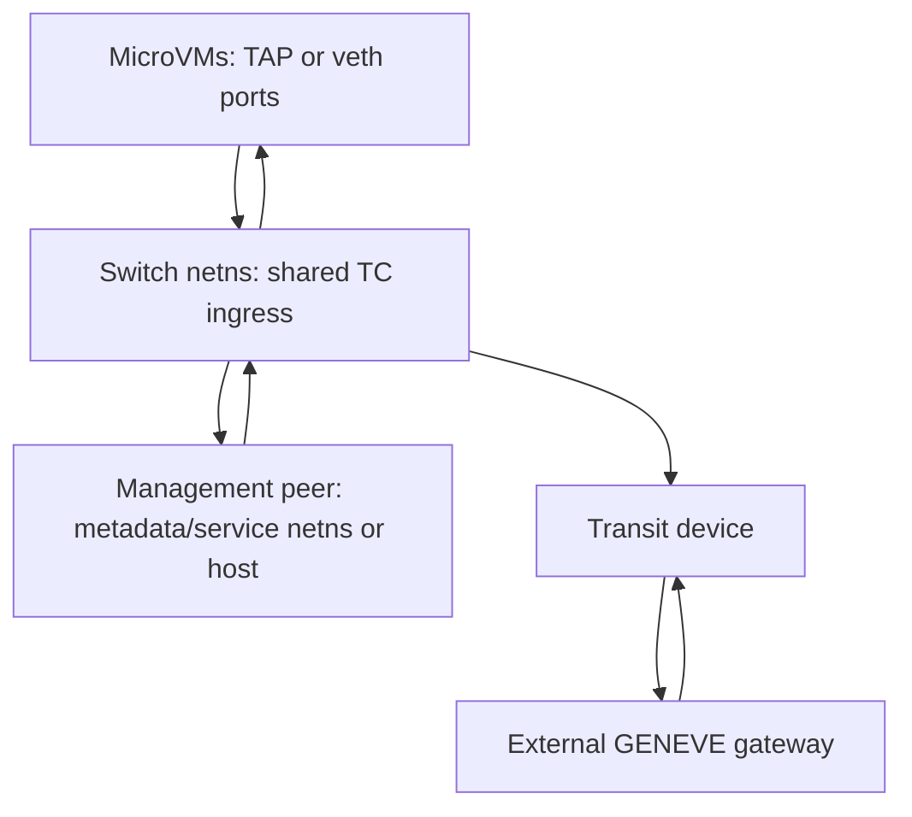
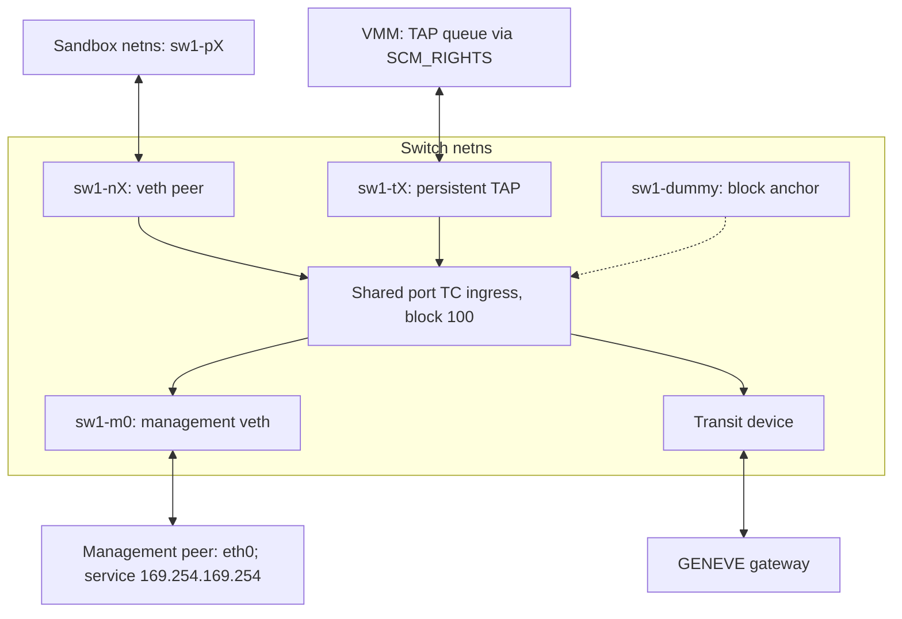
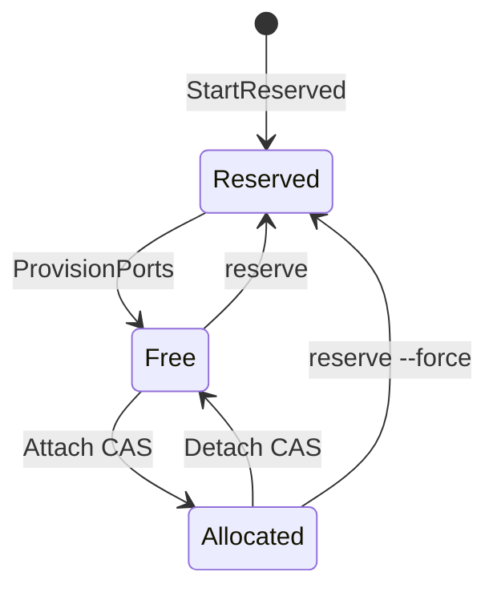
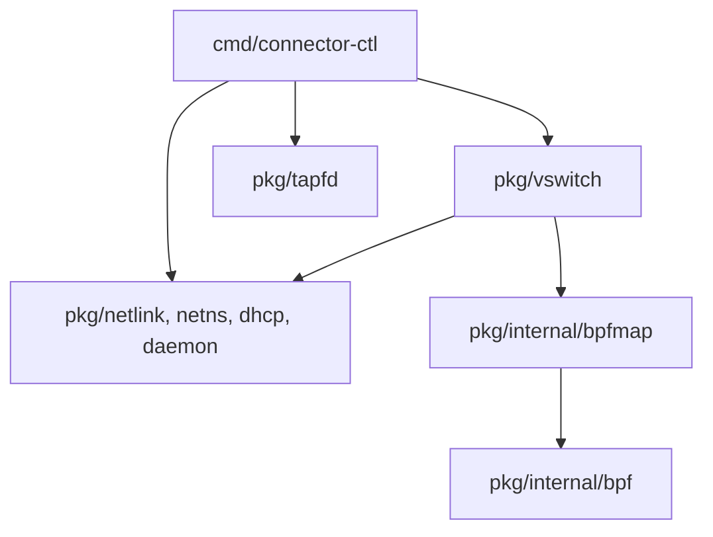

[English](vswitch.md) | [简体中文](vswitch_zh.md)

# vswitch — eBPF virtual switch

An eBPF/TC virtual switch providing isolated management and external-network paths for up to **4096 configured sandbox ports** on one host. The CLI is `connector-ctl vswitch`; the same binary also provides `connector-ctl tapfd get` for TAP descriptor handoff. The compiled port capacity is not a guarantee that every host/workload sustains 4096 active MicroVMs.

The forwarding path runs in kernel TC ingress programs. One-shot configuration commands can exit while TC references, pinned maps and network devices retain the data plane. `serve` remains a control/health/TAPFD-provider process; it does not relay forwarded packets. Slot selection uses ingress ifindex, floating IP or the configured GENEVE locator, rather than trusting a sandbox-supplied source IP/MAC as port identity. The local program has no direct port-to-port branch, answers ARP itself and rewrites Ethernet source addresses. These properties can be audited in the source; external gateway and management-service policy remain separate boundaries.

In TAP mode, `SCM_RIGHTS` passes the queue descriptor to a VMM such as Cloud Hypervisor or Firecracker. The independent provider/consumer contract is in [tapfd.md](tapfd.md).

CLI, configuration, build, deployment and troubleshooting are covered by [vSwitch operations](vswitch-operations.md).

## 1. Overview

### 1.1 Problem

The target is networking for thousands of MicroVMs on one host: in-kernel forwarding without a userspace packet relay, local sandbox isolation, roughly 4K port capacity, and separation of control-process failure from forwarding. A bridge plus netfilter, OVS/OVN, or per-VM veth orchestration can implement other valid designs, but their isolation, broadcast, routing and lifecycle policies must be configured appropriately. This project chooses a smaller dedicated forwarding model; it does not establish a universal per-port rule count or measured performance disadvantage for those alternatives.

Forwarding decisions are concentrated in [bpf/switch_kern.c](../bpf/switch_kern.c), with control operations updating BPF configuration and devices. The eBPF/TC design provides:

- Forwarding in the kernel without a userspace packet relay. This does not guarantee zero memory copies or context switches across the complete guest/VMM/network path.
- TC references retaining programs and bpffs pins retaining maps after a control process exits, as long as the underlying resources remain intact.
- One dedicated forwarding implementation to review, rather than a policy assembled across bridge forwarding tables and multiple firewall chains.
- Per-CPU counters and bpftool inspection.

### 1.2 Design principles

1. **Local isolation:** no direct port-to-port forwarding branch; ARP replies and output MAC addresses are controlled by the switch.
2. **Stateless forwarding:** no connection table; decisions use slot configuration and IP/UDP/GENEVE locator arithmetic, with optional static management-service translation.
3. **Independent process lifecycle:** `start`, `attach` and `detach` return while the in-kernel data plane continues.
4. **Concurrent ownership:** mmap and atomic CAS establish slot ownership. New switches with `geneve_opts` also serialize compound Attach/Detach/Reserve updates with a per-switch flock; legacy switches without that map retain the CAS-only path.
5. **Observability:** per-port, per-direction, management/transit packet and byte counters; status uses Kubernetes-style Conditions.
6. **systemd integration:** `Type=notify`, watchdog keepalives and reopening pinned resources after restart.

### 1.3 Boundaries

- One transit uplink device. Upstream networking owns ECMP or link bonding.
- No data-plane rate limiting/QoS; deployments can use VMM, TC qdisc or appropriate cgroup-BPF mechanisms.
- No connection tracking, stateful NAT table or L7 filtering. Management IP/port rewriting is static and stateless.
- `--mgmt-extract` / `--mgmt-service` are fixed at start; changing them requires switch recreation.
- Extraction CIDRs classify traffic only. Deployment owns management-interface addresses, local routes, service listeners and relevant sysctls.
- `MAX_PORTS=4096` is compiled into BPF and tied to the 12-bit slot-locator layout (§4.2).
- Control is local to a host; there is no cross-host state synchronization.

### 1.4 Deployment shape



This fits a single-host MicroVM platform using Firecracker, Cloud Hypervisor or QEMU/KVM where each VM needs controlled egress and configured port capacity stays within 4096. It is not a distributed SDN control plane, a fine-grained L4+ multi-tenant policy manager or a connection-tracking/L7 security gateway.


## 2. Network architecture

### 2.1 Topology and device names



Device names follow `<switch>-{p,n,m,t}<id>`: `sw1-p7` is the sandbox veth peer, `sw1-n7` its switch peer, `sw1-m0` the switch-side management device, and `sw1-t7` a persistent TAP. The addressless `<sw>-dummy` anchors the BPF filter on shared TC block 100, keeping it referenced even before any port device attaches; StartReserved creates it and Stop removes it. Port ingress devices share `ingress_block=100`; `skb->ingress_ifindex` identifies the slot. Management/transit ingress use their corresponding programs.

### 2.2 Namespace layout

| Namespace | Purpose | Devices |
|---|---|---|
| `netns_switch` | Internal switch networking. | `<sw>-nX`, `<sw>-mX`, `<sw>-tX` in TAP mode, `<sw>-dummy`, transit. |
| `netns_ports` | Initial veth peer location. | `<sw>-pX`, later moved into a sandbox namespace by attach. |
| `netns_mgmt` | Management service networking. | Management peer, such as eth0. Optional: an empty namespace leaves it in the caller/host namespace. |
| Sandbox namespace | A sandbox's veth peer. | `<sw>-pX`, moved from port-netns. TAP mode instead hands a queue descriptor to the VMM. |

### 2.3 Packet paths

CIDRs from `--mgmt-extract` populate each slot's destination classifiers; they do not assign addresses to the management peer. Connector creates the pair, sets MAC/MTU, brings it up, attaches TC, records extraction matches and installs floating-IP return routes. Deployment supplies interface addresses, local routes, service listeners and sysctls, ensuring the selected destination is local or otherwise reachable in the management namespace. The service template uses MGMT_ADDRS for explicit address assignment ([§1.3](vswitch-operations.md#13-systemd-integration)).

**Sandbox → management service**, for example 169.254.169.254:

| Stage | Packet/action |
|---|---|
| Sandbox and port ingress | `src=169.254.1.1, dst=169.254.169.254`; veth path `sw-pX` → `sw-nX` (TAP enters its corresponding port ingress). |
| TC management match | Match `mgmt_cidrs[]`; SNAT source to floating_ip; increment mgmt_tx. |
| Management veth and service | `sw-mX` → management eth0; the service sees the floating source, such as `100.100.96.X`. |

**Management service → sandbox:**

| Stage | Packet/action |
|---|---|
| Management return | `src=169.254.169.254, dst=floating_ip`; eth0 → `sw-mX`. |
| TC management ingress | Derive `slot_id=dst-floating_ip_base`; DNAT destination to inner_ip; set destination MAC to the selected port MAC; increment mgmt_rx. |
| Port delivery | Switch port → sandbox veth peer or TAP queue. |

**Return routes:** replies addressed to floating IP must reach management-side TC for DNAT. Start installs routes scoped to the fixed maximum floating span of 4096 addresses, using the containing /20 and metric `100+index`, rather than replacing the namespace's default route:

```text
ip route add <floating_ip_base>/20 dev <mgmt-dev> metric <100+index>
```

If the floating base is not /20-aligned, the maximum span crosses two /20s and both routes are installed. Addresses captured by those routes but outside the configured floating range reach the management device. With no matching slot, `tc_ingress_mx` returns `TC_ACT_OK` without sandbox DNAT/redirect, leaving further processing to the switch namespace stack and its filtering policy. This is not a TC-enforced drop. An empty management namespace means these routes are in the caller/host namespace; they still do not replace its default route.

**Optional management-service translation:** without `--mgmt-service`, extraction changes inner↔floating addressing while retaining the requested service destination IP/port. Deployment must make the VIP reachable and listen appropriately. `--mgmt-service=<VIP>:<vport>:<targetIP>:<targetPort>` adds deterministic stateless TCP/UDP translation:

| Direction | Rewrites and result |
|---|---|
| Outbound | After management classification, SNAT inner→floating source. A forward-map hit DNATs `VIP:vport` to `targetIP:targetPort`. The backend sees the floating source. |
| Inbound | Floating destination identifies the slot and is DNATed to inner_ip. A reverse-map hit SNATs `targetIP:targetPort` to `VIP:vport`, so the sandbox sees the expected service endpoint. |

The static start-time maps are `mgmt_svc_fwd` (`{VIP,vport,proto}` → `{targetIP,targetPort}`) and `mgmt_svc_rev` (the reverse key/value). These are hash lookups without connection tracking. A service-table miss and non-TCP/UDP traffic follow the original management path. VIP must match an extraction route, target IP/port pairs must be globally unique for reverse lookup, and the service mapping is IPv4-only. Deployment owns backend reachability. A loopback target requires route_localnet on the management device; otherwise the kernel can reject it as martian traffic.

**Sandbox → external network:** a non-management destination, such as 8.8.8.8, enters port TC. TC encapsulates it in GENEVE and increments transit_tx. The outer IPv4 source is transit_ip, destination is gateway_ip, and the UDP source is derived from the inner five-tuple. The configured locator encodes the zero-based slot; opaque options travel only in this outbound direction. Ether-over-GENEVE sets inner source to the selected port MAC and inner destination to transit MAC; IP-over-GENEVE has no inner Ethernet header. The transit device sends the packet to the gateway.

**External network → sandbox:** the gateway sends a packet satisfying the configured strict locator contract. Transit TC recovers the slot, verifies allocation, ifindex, outer gateway-source IP and VNI, removes encapsulation, rewrites the destination MAC for the port and increments transit_rx before delivery.

Two invariants govern slot selection and delivery:

- Slot identity comes from ingress ifindex, floating destination arithmetic or the configured locator, not from a sandbox-claimed source IP/MAC.
- Return delivery uses the selected fixed/derived port MAC, matching the device/VMM receive configuration.

## 3. Data plane

### 3.1 eBPF attachment points

| Device | Attachment | Program | Function |
|---|---|---|---|
| `<sw>-nX` / TAP port | TC ingress, shared block 100. | `tc_ingress_nx` | ARP replies; management extraction/SNAT and optional service DNAT; GENEVE encapsulation; mgmt_tx/transit_tx. |
| `<sw>-mX` | TC ingress. | `tc_ingress_mx` | ARP replies; floating→inner DNAT and optional reverse service SNAT; mgmt_rx and delivery. |
| Transit | TC ingress. | `tc_ingress_transit` | GENEVE decapsulation, source-IP/VNI validation, transit_rx and delivery. |

GENEVE inner traffic can be IPv4 or IPv6; management translation and slot.inner_ip are IPv4.

### 3.2 Pinned maps (`/sys/fs/bpf/<sw>/`)

| Map | Type | Shape | nx | mx | transit | Contents |
|---|---|---|---|---|---|---|
| `slots` | ARRAY + MMAPABLE | 4096 × 108-byte value, 112-byte mmap stride. | R | R | R | Slot configuration; userspace CAS on inner_ip allocates/releases ownership (§4.3). |
| `config` | ARRAY | 1 × 40 bytes. | R | R | R | Switch MAC, port count, floating base, GENEVE locator/encapsulation, transit nexthop and port MAC. |
| `metadata` | ARRAY | 1 × 4096 bytes. | — | — | — | JSON SwitchMetadata for userspace only; additive fields do not alter BPF layout. |
| `stats` | PERCPU_ARRAY | 4096 entries per CPU. | W | W | W | Management/transit receive/transmit packet/byte counters. Attach confirms a reset in `slots.stats_ready`; reset failure is nonfatal for attach but prevents Stats from publishing retained counters. Detach retains stored counters without publishing them as a current attachment. |
| `ifindex_to_slot` | HASH | Ingress-device mapping. | R | — | — | ifindex→slot lookup on outbound port ingress. |
| `geneve_opts` | ARRAY | 4096 × 68 bytes. | R | — | — | Complete serialized opaque options; automatic TLV locator is not stored here. |
| `mgmt_svc_fwd` | HASH | Static service entries. | R | — | — | `{VIP,vport,proto}` → `{targetIP,targetPort}`, TCP and UDP entries per service. |
| `mgmt_svc_rev` | HASH | Static reverse entries. | — | R | — | `{targetIP,targetPort,proto}` → `{VIP,vport}`. |

New switches create/pin the service maps even when no service mapping is configured. Slot lookup on inbound traffic uses arithmetic or the fixed locator layout, without a generic inbound slot-index hash or TLV search. Management-service translation still has its separate hash maps.

Stats takes a nonblocking shared lock on the existing pin-directory control flock and verifies the current pinned slots map ID. Attach/detach/reserve and switch replacement use its existing exclusive side. A busy control operation, replaced map, unconfirmed reset or failed map read produces an error for the entire requested batch. Shared readers can proceed concurrently. Explicit free/reserved ports return `ErrPortNotAttached`; an omitted port list selects only allocated slots. A confirmed reset makes zero valid; reset failure leaves attach successful and reports `ErrStatsUnavailable` until a later successful attach. No second ownership table is introduced.

The reset flag uses the former four padding bytes at offset 104; the slot remains 108 bytes with a 112-byte mmap stride. BPF counting instructions do not read it. Readers need current control code and an attachment whose reset was confirmed. A switch without the existing `geneve_opts` map has no common ownership lock and cannot provide this coherent Stats read; rebuild it before collecting traffic. The datapath and Create success conditions remain unchanged.

### 3.3 Data-plane ABI

Go code that directly reads/writes these C structures by byte offset is isolated in `pkg/internal/` (§9). Changing an offset is an ABI change and requires synchronized Go and BPF updates.

```c
struct slot_item {                          // 108 bytes, cache-line layout
    // Cache line 0 (hot path)
    __u32 ifindex;                          // offset  0
    __u32 inner_ip;                         // offset  4 — 0=Free, 0xFFFFFFFF=Reserved, other valid IP=Allocated
    __u32 transit_ifindex;                  // offset  8
    __u32 transit_ip;                       // offset 12
    __u32 transit_gateway_ip;               // offset 16
    __u32 transit_geneve_vni;               // offset 20
    __u8  transit_mac[6];                   // offset 24
    __u8  mode;                             // offset 30 — 0=veth, 1=tap (userspace metadata, not read by BPF)
    __u8  geneve_opts_len;                  // offset 31 — opaque bytes only; 0 skips geneve_opts lookup
    __u32 mgmt_cidr_count;                  // offset 32
    struct mgmt_cidr mgmt_cidrs_0;          // offset 36 (20B) — first inline CIDR (hot path)
    __u8  _pad_cl0[8];                      // offset 56
    // Cache line 1 (cold path)
    struct mgmt_cidr mgmt_cidrs_ext[MAX_MGMT_CIDR_EXT]; // offset 64 (40B)
    __u32 stats_ready;                      // offset 104 — userspace confirmed current-attach reset
};   // 108 bytes; 8-byte mmap alignment gives 112 bytes/slot, 448 KiB for 4096 slots

struct switch_config {                      // 40 bytes
    __u8  switch_mac[6];
    __u16 _pad;
    __u32 n_ports;
    __u32 floating_ip_base;
    __u32 geneve_port_base;
    __u8  geneve_encap_eth;
    __u8  _pad3[3];
    __u32 transit_nexthop;
    __u8  port_mac[6];                      // all zero: derive; nonzero: fixed
    __u8  _pad4[2];
    __u8  geneve_locator;                   // 0=port,1=vni,2=tlv
    __u8  geneve_tlv_type;                  // exact 8-bit wire type
    __u16 geneve_tlv_class;
};

struct geneve_opts_value {                  // 68 bytes
    __u8  len;                              // opaque wire bytes
    __u8  critical;                         // whether any opaque type has bit 0x80
    __u16 reserved;
    __u8  data[64];                         // option header + opaque data
};

struct slot_stats {                         // per-CPU
    __u64 mgmt_rx_packets, mgmt_rx_bytes;
    __u64 mgmt_tx_packets, mgmt_tx_bytes;
    __u64 transit_rx_packets, transit_rx_bytes;
    __u64 transit_tx_packets, transit_tx_bytes;
};
```

`slot_item.geneve_opts_len` is an opaque-option lookup hint; it excludes the eight-byte automatic TLV locator. Attach/show JSON reports total wire length instead ([§2.4](vswitch-operations.md#24-connector-ctl-vswitch-attach)). The slot's mmap stride is 112 bytes, not its C value size of 108.

Program paths check packet bounds and slot validity before use: Ethernet and relevant IP/header bounds, decapsulation extent, allocated inner_ip (neither Free nor Reserved), nonzero ifindex and `slot_id<n_ports`. **The outer transit IPv4 decoder** requires `ihl==5`; this must not be generalized to every management/inner-IP parsing path. Transit return also checks configured gateway source IP and VNI.

A new switch always creates and pins geneve_opts. Opening a legacy pinned switch treats that map as optional **only on ENOENT**; other load errors mean damage. Zero bytes in the old config's trailing padding decode as the legacy `port` locator. Thus old switches remain usable for Open/status/show, empty-option Attach, Detach and Stop. Nonempty opaque options or vni/tlv locator require stop and recreation with the new implementation. No map is added to an active old switch and no attached TC program is replaced in place.

## 4. Key mechanisms

### 4.1 MAC derivation

ARP and derived device MACs share a namespace based on switch_mac, with format `SS:SS:SS:SS:BB:LL`:

- Bytes 0–3 retain `switch_mac[0..3]`.
- Byte 4 is `((switch_mac[4] ^ 0x80) & 0x80) | (id >> 8)`.
- Byte 5 is `id & 0xFF`.

Port IDs are zero-based slot IDs, `0x000..0xFFF`; management IDs are `0x7FF0+mgmt_idx`. The high bit of derived byte 4 is the inverse of switch_mac byte 4's high bit, preventing collision with the switch MAC. The lower four bits encode the high four slot bits, supporting 4096 ports. The formula imposes no additional byte-4 collision constraint, but the input still must be a valid six-byte MAC usable for the deployment's network devices. Go and BPF compute the same formula and must change together.

`--port-mac-addr` selects the port MAC:

| Mode | MAC | Use |
|---|---|---|
| `fixed` (default) | Derive with slot_id=1 and use that MAC for every port. | Snapshot relocation into a different free slot without reconfiguring the guest MAC. |
| `per-port` | Derive from each actual slot ID. | Tests or gateway-side MAC distinction. |
| Explicit MAC | Same user-supplied address on all ports. | Specific compatibility requirements. |

### 4.2 GENEVE tunnels

Connector runs on the sandbox host; an external GENEVE gateway provides access to external networks. Their contract covers framing, slot location and return validation. Locators encode **zero-based slot_id=0..4095**, not the CLI's one-based `port=slot_id+1`. Opaque option semantics belong to the caller and gateway: Connector does not define tenant/sandbox/policy schemas or interpret their data.

Encapsulation modes; return decoding recognizes geneve proto_type:

| Mode | proto_type | Inner packet | Purpose |
|---|---|---|---|
| **IP-over-GENEVE** (default) | ETH_P_IP / ETH_P_IPV6 | Bare IP. | Saves an inner 14-byte Ethernet header; suitable for switch-to-switch integration. |
| **Ether-over-GENEVE** | ETH_P_TEB (0x6558) | Full Ethernet frame. | Linux GENEVE devices and gateway bridges. |

Locator wire contract:

| Locator | Outbound UDP destination | Outbound VNI | Automatic locator | Configured VNI range | Strict return |
|---|---|---|---|---|---|
| `port` (default) | geneve_port_base + slot_id | Full transit_geneve_vni. | None. | 0..0xffffff | OptLen=0, C=0; recover slot from UDP destination. |
| `vni` | 6081 | `(slot_id << 12) \| transit_geneve_vni`. | High 12 VNI bits. | 0..0x0fff | UDP destination 6081, OptLen=0, C=0; recover high 12 bits and verify low 12 bits. |
| `tlv` | 6081 | Full transit_geneve_vni. | First eight-byte option. | 0..0xffffff | UDP destination 6081; options consist of exactly the one eight-byte locator. |

The VNI locator has a fixed 12/12 split:

| VNI bits | Width | Meaning |
|---|---|---|
| 23..12 | 12 | slot_id |
| 11..0 | 12 | transit_geneve_vni |

`--geneve-tlv-locator=CLASS:TYPE` is an exact wire class/type. For `0102:81`, type is raw byte 0x81, including its critical bit; Connector does not silently set or clear 0x80. The generated option is Class=configured class, Type=configured type, Length=1, Data=be32(slot_id), eight bytes total, always first. New protocols may choose a critical type, but the two peers must agree.

[Operations §2.4](vswitch-operations.md#24-connector-ctl-vswitch-attach) contains the complete attach command example. The wire contract follows.

Class, type and data are hex; type is the exact eight-bit wire value. Data length must be a multiple of four bytes, including zero (`0102:02:`). Input order, data byte order and duplicates are preserved. In TLV mode, an opaque option cannot share the locator's class and low seven type bits, even with a different critical bit. The GENEVE base C bit is one if the locator or any opaque option has `type & 0x80 != 0`, otherwise zero.

Total wire options are limited to **64 bytes**, including every four-byte option header, opaque data and the TLV locator's eight bytes. Port/vni modes permit 64 bytes of opaque options; TLV permits 56. Opaque options are outbound Connector→gateway only, currently set on Attach rather than updated online, and are not delivered back to the sandbox.

Return decoding is deliberately strict. Port/vni reject options or C=1. TLV requires exactly one first/only locator with matching class/type, length=1, in-range big-endian slot ID, zero reserved bits and a base C bit matching the locator type's critical bit. The gateway must **not echo outbound opaque options** on return. After recovering the slot, all modes check allocation, ifindex, gateway source IP and configured VNI.

The inner five-tuple Jenkins hash selects an outer UDP source in **49152–65535** for underlay ECMP/RSS. An omitted locator means port. With no opaque options, default port-mode framing retains the legacy wire encoding for equivalent inputs.

For outer L2 delivery, bpf_redirect_neigh uses the kernel neighbor subsystem; the BPF program maintains no ARP cache. In Ether-over-GENEVE, the inner destination is transit-mac-addr or broadcast, and the inner source is the selected port MAC, matching the device/VMM configuration for gateway bridge learning.

Packet-capture commands and field inspection belong to [Operations §3.1](vswitch-operations.md#31-geneve-packet-capture).

### 4.3 Slot allocation and state machine

Separate BPF Lookup and Update syscalls permit a TOCTOU race: two processes can observe a free slot and overwrite each other. The slots array uses BPF_F_MMAPABLE; userspace maps it and uses atomic.CompareAndSwapUint32 on inner_ip for atomic ownership. The atomic claim itself needs no lock, while new-switch compound operations also use flock (§4.4).

| inner_ip | State | Meaning |
|---|---|---|
| 0x00000000 | Free | Available after provisioning. |
| 0xFFFFFFFF | Reserved | Explicit StartReserved/reserve/provision state. |
| Valid real inner IPv4 | Allocated | Attached port. |



| Operation | Transition | CAS |
|---|---|---|
| Attach | Free→Allocated. | CAS(inner_ip, 0, innerIP). |
| Detach | Allocated→Free. | CAS(inner_ip, currentIP, 0); on new switches clear the hint under control flock, retaining map bytes for the next Attach. No Reserved intermediate. |
| Reserve | Free→Reserved; force can replace Allocated. | CAS to 0xFFFFFFFF. |
| Provision complete | Reserved→Free. | CAS(inner_ip, 0xFFFFFFFF, 0). |

Failed operations attempt to undo their own claim or device movement, without overwriting a different owner. A CAS claim is not an atomic publication of every data-plane field, and rollback/device operations can themselves fail. Callers must use operation results and inspect/reconcile state after an error (§5.4).

### 4.4 Control-operation serialization

CAS protects one slot's ownership. Multi-resource operations and new-switch updates spanning mmap slots plus geneve_opts use `flock(LOCK_EX)` on `/sys/fs/bpf/<sw>/`:

| Operation | flock | CAS |
|---|---|---|
| Start / StartReserved | Yes. | Mark slots Reserved. |
| Stop / stop --force | Yes. | The stop cleanup phase is not a single slot CAS; forced release is a separate step. |
| ProvisionPorts | Yes. | Reserved→Free per completed slot. |
| New-switch Attach / Detach / Reserve | Yes, covering claim, map/MTU/device work and hint publication/retraction. | Yes. |
| Legacy Attach / Detach / Reserve without geneve_opts | No. | Existing CAS-only path. |

After acquiring flock and before CAS, new-switch Attach/Detach/Reserve compare the opened slots map's kernel ID with the map currently pinned at that name. If the switch was stopped/recreated while the operation waited, the old context fails and must be reopened; it does not mutate an unpinned obsolete map.

### 4.5 Two-phase startup

Startup is split to support Type=notify and early control-plane availability.

**Phase 1, StartReserved:** validate configuration; load BPF objects and pin maps; write config/metadata, with transit auto-address DHCP in this phase; mmap slots and CAS them to Reserved; create the dummy block anchor; create management veth/TC and return routes, and populate service maps; move/configure/bring up transit, including MTU/IP. Programs are retained by TC references. This phase includes network/RTNL work and has no universal 100 ms duration. Status becomes available while slots remain Reserved.

**Phase 2, ProvisionPorts:** for each Reserved slot, create its veth pair or persistent TAP, attach shared port ingress, write device/management/transit fields and CAS Reserved→Free. Free/Allocated slots are skipped; a failed slot stays repairable with `provision --port=X`.

`serve` orders its work as follows:

1. StartReserved, or reopen the compatible existing switch.
2. Start the optional TAPFD listener; listener startup failure prevents normal readiness.
3. Send `sd_notify(READY=1)` and report initial status.
4. Provision ports asynchronously.
5. Run health checks and watchdog keepalives; handle listener/provision failure and termination signals. SIGTERM/SIGINT exits the process without tearing down the switch data plane.

Dependent services can start after READY=1, before every port is provisioned. They must handle temporary unavailability and retry; readiness of the systemd process is not proof that all ports are Free. The `Ready` Condition also excludes Reserved slots from device checks, so inspect capacity or the selected slot as described in [§2.9](vswitch-operations.md#29-connector-ctl-vswitch-status). A Reserved slot can reject the ownership CAS before the later unprovisioned-device check; callers must handle that allocation failure too.

### 4.6 Port modes: veth and TAP

Each slot records its kind in slot_item.mode. This is userspace metadata; BPF does not read it. Both kinds enter the same port TC program and select their slot by ifindex. Their control and descriptor lifecycles differ:

| | **veth** (mode=0) | **TAP** (mode=1, CLI default) |
|---|---|---|
| Switch device | `<sw>-nX`. | Persistent `<sw>-tX`, using TUNSETPERSIST. |
| Sandbox side | `<sw>-pX`, moved to sandbox-netns by attach. | No moved netdev; the VMM receives a queue descriptor through SCM_RIGHTS. |
| port-netns | Required for veth provisioning. | Not needed; TAP stays in switch-netns. |
| Attach | Slot claim/control updates plus optional peer movement. | Slot claim/control updates; reject missing provisioned ifindex. |
| Detach | Release claim and return/check peer, unless skipped. | Release claim without moving the TAP. |
| Descriptor access | Not applicable. | open-port or attach --open-port ([§2.8](vswitch-operations.md#28-connector-ctl-vswitch-open-port)). |

For a Reserved slot, `provision --mode=<new>` creates the new-kind device before committing its ifindex, then removes the old-kind device. Names differ, allowing temporary coexistence.

Attach/detach do not create or delete port devices. Provision creates them; normal/forced Stop removes owned devices. Force-clean only unpins maps and can leave devices/filter references. `--skip-device` controls permitted movement/checks; it does not turn attachment into a device-provisioning operation.

### 4.7 TAP descriptor handoff

[tapfd.md](tapfd.md) independently defines the vendor-neutral SCM_RIGHTS, NUL-terminated key=value metadata and TAPFD_SOCKET contract. This section records Connector's provider choices.

**Metadata:** in addition to mandatory `fd=`, send `mac` (selected port MAC, to mirror into the VMM's virtio-net receive configuration), `ip` (real sandbox inner IP), and diagnostic `port` (one-based; a consumer may ignore it). Slot dispatch uses ifindex, not the supplied MAC:

```text
port=1 mac=02:00:00:00:80:01 ip=169.254.1.1 fd=1\0
```

If requested through TAPFD_WANT_NETNS, append the switch namespace descriptor after the TAP queue and set netns_fd=1, allowing a capable consumer to setns and operate on the device ([requesting a netns descriptor](tapfd.md#34-requesting-a-netns-descriptor-tapfd_want_netns)).

**Provider helper:** resolve TAPFD_SOCKET as fd=N or a path, enter switch-netns, open /dev/net/tun and attach with IFF_TAP|IFF_NO_PI|IFF_VNET_HDR. The vnet header is a property of this queue attachment; do not infer it solely from persistent-device creation flags. After sending, close local descriptors and exit. Persistence keeps the TAP device alive, but queues still follow descriptor lifetimes. A later consumer can request a fresh handoff subject to the provider contract.

`attach --open-port` combines allocation and transfer. If transfer fails, the CLI attempts Detach with SkipDevice to undo the claim while retaining the provisioned TAP. Cleanup errors are not a guarantee of a clean slot; callers should inspect/reconcile status before retry. Stop/close the previous VM/queue consumer before reusing its slot.

**Preflight:** before socket/TAP access, require TAP mode, provisioned ifindex and an attached real inner IP. Missing switch yields exit code 3.

**Consumers:** third parties can implement tapfd.md §2. The repository supplies [pkg/tapfd](../pkg/tapfd/) with RecvFd, RecvFds and RecvFdsWithNetns, and [examples/tapfd_receiver](../examples/tapfd_receiver/). A generic Unix byte-stream listener alone does not implement descriptor reception.

### 4.8 MTU validation

The implementation uses the following encapsulation budget:

`transit_mtu >= port_mtu + base_overhead + wire_options_len`

| Mode | Base overhead used by the check |
|---|---|
| IP-over-GENEVE | ETH(14) + IPv4(20) + UDP(8) + GENEVE(8) = **50 bytes**. |
| Ether-over-GENEVE | The above plus inner Ethernet(14) = **64 bytes**. |

These are the implementation's configured MTU budgets. TLV always adds at least eight option bytes, even with no opaque options. **Current two-phase provisioning does not carry the requested `--mtu` into new TAP/veth port devices**: the BPF SwitchConfig has no MTU field and provision creates ports with kernel defaults. The requested value is used for management-device setup and initial transit-budget checks. Inspect actual port MTUs rather than assuming the flag configured them.

`--transit-dev-mtu` has three paths:

- Omitted: leave transit MTU unchanged and validate fixed-locator overhead.
- `auto`: set `port_mtu + base_overhead + 64`, reserving the full permitted options budget so later valid Attach options do not require changing the active uplink.
- Numeric: set that MTU and validate fixed overhead.

An explicit requested MTU enables fixed-budget validation before resource creation. Without it, startup uses discovered devices or the default while Reserved ports do not yet exist. Because the requested value may differ from the later provisioned port MTU, initial validation alone is insufficient. Validate the actual port/transit pair before use; if deployment changes a port MTU explicitly, keep its peer/guest receive configuration consistent. The physical underlay still must carry the chosen frames; setting an interface MTU does not enlarge the upstream network.

When Attach's total wire options are nonzero, including the generated TLV locator, it reads the selected port and transit MTUs again before moving veth or handing off TAP. Failure keeps the options hint zero and attempts to release the CAS claim. The error reports every component, for example:

```text
transit device eth1 MTU 1570 is too small for port sw0-n1:
  port MTU 1500 + base GENEVE overhead 64 + options overhead 12 = required MTU 1576
```

### 4.9 DHCP gateway inference

For transit auto-addressing, StartReserved runs DHCP after bringing transit up. Router Option 3 is used when present. Otherwise the implementation infers the subnet's first usable address, for example 192.168.1.100/24 → 192.168.1.1, and logs that fallback. This supports DHCP servers that omit a router, but the heuristic does not prove a router actually exists there; configure an explicit gateway when the network differs.

## 5. Security and isolation

### 5.1 Threat model

Connector is a defense-in-depth layer outside the MicroVM; the VMM remains the primary guest isolation boundary. Sandbox code may be malicious. Host control-plane callers, management services and the external gateway must be governed by deployment policy.

| ID | Threat | Mechanism and scope |
|---|---|---|
| T1 | Sandbox forges source IP/MAC as port identity. | Slot selection derives from ifindex, floating destination or configured locator; output MACs are controlled. This is not an external-network anti-spoofing policy for every inner packet field. |
| T2 | Direct local sandbox-to-sandbox forwarding. | No port-to-port TC branch; local outbound paths are management or transit. Gateway/management-mediated access needs its own policy. |
| T3 | Unexpected GENEVE return source. | Verify configured outer gateway IP, locator and VNI. IP/VNI matching is not cryptographic peer authentication; the underlay/gateway remains trusted. |
| T4 | ARP broadcast crosses local ports. | Switch handles port ARP requests and returns replies locally instead of bridging requests to another sandbox port. |
| T5 | Control-process crash stops forwarding. | TC references, pinned maps and intact network resources outlive the process; serve can reopen them (§6.1). |
| T6 | Concurrent attach claims one slot twice. | mmap CAS gives one owner; compound new-switch updates also hold flock. |

### 5.2 Isolation invariants

1. **No direct port-to-port path:** the dedicated local forwarding program has no branch bridging one sandbox ingress to another sandbox ingress.
2. **Switch-owned ARP replies:** port ARP requests are consumed and answered back to that port, not broadcast to other ports.
3. **Controlled source MACs:** forwarded Ethernet headers use switch or selected port MACs rather than trusting the sandbox's source MAC as slot identity.
4. **Restricted transit return:** recover the slot using the configured locator and refuse sandbox decapsulation/delivery for invalid allocation/ifindex, gateway-source IP or VNI. Current nonmatching paths return `TC_ACT_OK` to the namespace stack; they do not promise a drop at the TC hook.
5. **Management address translation:** outbound source becomes floating IP and inbound destination becomes inner IP. This describes packet-header NAT, not concealment of IP values an application might put in payloads.

These are local data-plane properties. They do not authorize arbitrary traffic through the management backend or gateway, and they do not replace those systems' access controls.

The distinction between sandbox delivery and `TC_ACT_OK` follows [tc_ingress_mx / tc_ingress_transit](../bpf/switch_kern.c). Namespace-stack routing and filtering remain deployment responsibilities.

### 5.3 Required privileges

The supported privileged test/deployment baseline is root with the required capabilities. Exact reduced-capability execution depends on kernel, BPF policy, namespace ownership and pin-file permissions; this table describes relevant operations rather than a proven minimal capability set:

| Operation | Privilege considerations | Why |
|---|---|---|
| start / serve | CAP_SYS_ADMIN for namespace entry/setup and older BPF paths; CAP_NET_ADMIN for network/TC work. Modern BPF loading has its own CAP_BPF-related checks. | Load BPF, pin maps, enter namespaces, create/configure links and TC. |
| attach / detach / provision / open-port | Namespace-entry and network-device privileges, plus map/pin access as used by the path. | mmap/CAS, move/configure links, open TAP queues. |
| stop | CAP_NET_ADMIN plus namespace-entry privileges, normally CAP_SYS_ADMIN, and map/pin access. | Remove TC/devices and return transit through setns. CAP_BPF alone does not authorize setns. |
| status / stats / show | Appropriate pinned-map and kernel-BPF access; namespace/device inspection may impose additional checks. | Open/read maps and inspect state. |

Linux 5.8+ separates some BPF privileges into CAP_BPF, but this does not replace every CAP_SYS_ADMIN check. TC/device administration still needs the relevant network privileges.

### 5.4 Known limitations

| ID | Limitation | Handling |
|---|---|---|
| L1 | CAS owns inner_ip before all retained transit fields/options are updated. The complete attachment is not one atomic data-plane transaction; no bounded 1 µs window or unconditional packet-drop guarantee is established. | Stop/close the prior consumer before slot reuse; wait for successful attachment before exposing the new consumer. Treat errors as requiring state inspection, and allow protocol retry for transient loss. |
| L2 | External destruction of a sandbox namespace before detach can leave an allocated slot after its device disappears. | Confirm the old consumer is gone and reconcile ownership/device state; deliberate detach --skip-device or forced stop can recover depending on the remaining state. Capacity remains bounded by MAX_PORTS. |
| L3 | Physical transit failure. | Upstream redundancy can help only where configured; Connector itself has one transit device. Startup requires DOWN to avoid taking over an active interface. |
| L4 | MAX_PORTS=4096. | Increasing capacity requires synchronized BPF/Go bounds and the fixed 12-bit locator ABI, not merely editing one constant. |
| L5 | Broad extraction CIDRs admit unintended management traffic; the slot stores only three CIDRs total. | Prefer narrow routes such as /32 and inspect the actual programmed slots. |
| L6 | Unreachable management-service target, especially loopback. | Validate VIP/extraction and target uniqueness; deployment still supplies routing/listeners and route_localnet for loopback. |
| L7 | Legacy switch lacks geneve_opts. | Existing no-option port-mode operations remain supported; stop/recreate before vni/tlv or opaque options. No online map/program migration. |
| L8 | Requested --mtu is not propagated into newly provisioned TAP/veth ports. | Check actual device MTUs and the full underlay budget (§4.8); initial startup validation and CLI help from older versions are not proof of the port value. |

## 6. Reliability

### 6.1 Resource lifecycle and crash recovery

| Resource | Lifetime mechanism | After control-process exit |
|---|---|---|
| BPF program | TC filter references. | Retained while those references exist. |
| BPF maps | bpffs pins under `/sys/fs/bpf/<sw>/`. | Retained while pinned/referenced. |
| veth / TAP / dummy / transit | Kernel devices/namespaces; persistent TAP where configured. | Retained while the owning resources remain intact. |
| flock | Released when the process closes/exits. | Does not permanently block the next control operation. |

After a serve crash, systemd Restart=on-failure launches a process that reopens compatible pinned state, skips already Free/Allocated ports during provisioning and resumes control/provider service. Existing forwarding can continue during this **process-only** restart. Deleted namespaces/devices, damaged maps, host reboot or incompatible ABI are different failures and are not covered by that guarantee.


## 7. Performance characteristics

Data-plane measurements must record source/binary revision, host and guest kernel, CPU/NUMA placement, NIC and veth topology, MTU, offloads/GRO/GSO, packet sizes, flows, offered load and failures. Small-packet packet-rate and bulk-TCP throughput measure different costs. Isolate BPF, namespace/veth and tunnel work before attributing overhead.

Control-plane measurements must identify Start/StartReserved/Provision/Attach/Detach/Stop, requested and available ports, kernel/RTNL conditions and their actual completion signals. Determine readiness from the lifecycle ordering and Conditions in §4.5, not elapsed delays.

Use the maintained test entry points below and the [project performance methodology](https://github.com/kuasar-sandbox/kuasar-sandbox/blob/main/docs/perf.md). Historical figures without pinned inputs and raw evidence are not a current capacity or latency baseline.

The small `BenchmarkNativeTrafficStats` benchmark reads 1/16/64 attached ports from real pinned maps, reporting allocations and FD/goroutine deltas. Run it on a BPF-capable host; results are local measurements, with no machine-specific pass threshold:

```bash
GOWORK=off go test -tags=integration -exec 'sudo -n env REQUIRE_CONNECTOR_STATS=1' \
  -run '^$' -bench BenchmarkNativeTrafficStats -benchtime=300ms -count=3 ./pkg/vswitch
```

## 8. Tests

### 8.1 Layers

| Layer | Files | Privilege | Coverage |
|---|---|---|---|
| Unit | `*_test.go`. | Ordinary user. | Pure logic with injected BPF/netlink dependencies. |
| Integration | `*_integration_test.go`. | Root/BPF-capable kernel. | Real BPF loads/netlink with integration build tags and privileged execution. |
| End-to-end | [test/e2e](../test/e2e/) `*_test.sh`. | Root. | Real topology/packets; setup/test/teardown/all script modes where provided. |
| Benchmarks | [perf_bench.sh](../examples/perf_bench.sh), [start_perf_bench.sh](../examples/start_perf_bench.sh). | Root and iperf3. | Throughput/PPS/RTT at varying port counts and control-plane startup timing. |

### 8.2 Three levels of BPF validation

1. **Layout:** integration tests under pkg/internal/bpf verify Go/C offsets, sizes and alignment.
2. **BPF_PROG_TEST_RUN:** construct packets, execute the program and assert actions/output bytes. Where ingress_ifindex cannot be supplied conveniently, tests map ifindex=0 to the test slot for tc_ingress_nx.
3. **Real topology:** test/e2e scripts create networks and use actual ping/iperf traffic.

`TestNativeStatsRealResetReuseAndReadOnlyFailure` uses actual pinned per-CPU BPF maps and an independently opened reader, including a kernel-enforced read-only FD to prove reset failure. `TestNativeStatsRealConcurrentOwnership` exercises shared reads against attach/detach. Source integration CI runs these with `REQUIRE_CONNECTOR_STATS=1`, race detection and privileged execution; missing capability is a failure, not accepted skipped coverage.

### 8.3 E2E suites

| Script | Coverage |
|---|---|
| mgmt_isolation_test.sh | Management connectivity, local sandbox isolation, actual FloatingIP service NAT and asymmetric UDP packet/byte direction via `stats_management.py`. |
| geneve_eth_test.sh | Legacy port locator with Ether-over-GENEVE through a Linux gateway bridge. |
| geneve_ip_test.sh | IP-over-GENEVE between switches; run_all covers port/vni/tlv locators, bidirectional connectivity and transit counters. |
| provision_test.sh | Two-phase startup, Reserved-slot repair and show. |
| tap_test.sh | TAP mode, open-port, attach --open-port and mode changes. |

For manual topology construction and lifecycle operations, use the maintained [vSwitch operations guide](vswitch-operations.md). Consume the actual allocation returned by `attach`; do not infer a port from a sandbox index.

## 9. Internal organization

| Path | Role |
|---|---|
| `cmd/connector-ctl/` | Cobra CLI, JSON output/dependency injection and the tapfd provider subcommand. |
| `pkg/tapfd/` | Public protocol reference: PortMetadata, OpenTap, SendFd, RecvFd, RecvFds, RecvFdsWithNetns, ConnectUnix and UnixConnFromFd. |
| `pkg/vswitch/` | Public lifecycle API: context/Open, lifecycle/Start/StartReserved, provision, stop, Attach/Detach/Reserve, Status/Stats, Config/FileConfig, metadata, flock and exported helpers. |
| `pkg/netlink/` | Public veth/TAP/TC and batched netlink operations. |
| `pkg/netns/` | Public namespace enter/move/exec. |
| `pkg/dhcp/` | Public embedded DHCP client/server. |
| `pkg/daemon/` | Public systemd sd_notify support. |
| `pkg/internal/bpf/` | Internal BPF ABI: generated cilium/ebpf bindings, types and loader. |
| `pkg/internal/bpfmap/` | Internal ABI-coupled mmap, CAS, counters and MAC derivation. |
| `bpf/` | C sources: switch_kern.c, common.h and vmlinux.h. |
| `test/e2e/` | Component suites and run_all.sh. |
| `examples/` | Operations/benchmark scripts and tapfd_receiver source example. |
| `dist/` | systemd service/configuration templates. |

Byte-offset BPF structure access belongs in pkg/internal; a field-offset change is an ABI change. Go's internal rule permits imports only from within the parent pkg tree, not from cmd or arbitrary external modules. The other pkg packages expose the intended public API. CLI code uses helpers re-exported by pkg/vswitch/exports.go and follows the same API path as external embedders.

Dependency direction is acyclic:



pkg/tapfd is self-contained apart from the standard library and golang.org/x/sys.

## 10. See also

- [tapfd.md](tapfd.md): full provider/consumer descriptor-handoff contract.
- [sandboxer/docs/sandbox.md](https://github.com/kuasar-sandbox/sandboxer/blob/main/docs/sandbox.md): sandbox-ctl consumption through TAPFD helpers.
- [RFC 8926](https://www.rfc-editor.org/rfc/rfc8926): GENEVE framing.
- [Linux commit fc9702273e2e](https://github.com/torvalds/linux/commit/fc9702273e2edb90400a34b3be76f7b08fa3344b): mmap support for BPF_MAP_TYPE_ARRAY.
- [sd_notify](https://www.freedesktop.org/software/systemd/man/sd_notify.html): systemd Type=notify integration.
- [cilium/ebpf](https://github.com/cilium/ebpf) and [vishvananda/netlink](https://github.com/vishvananda/netlink): Go libraries used by the implementation.
