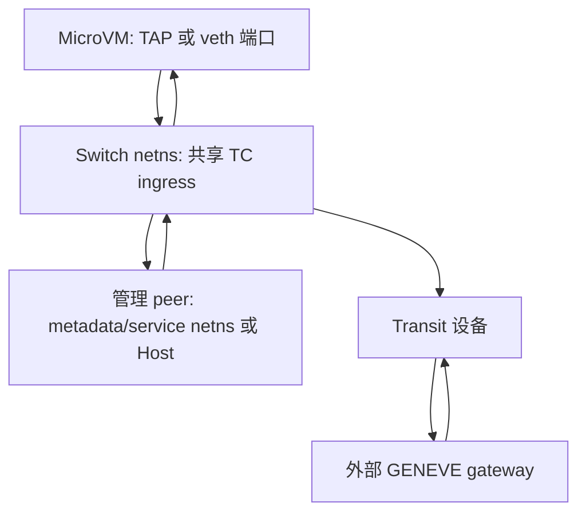
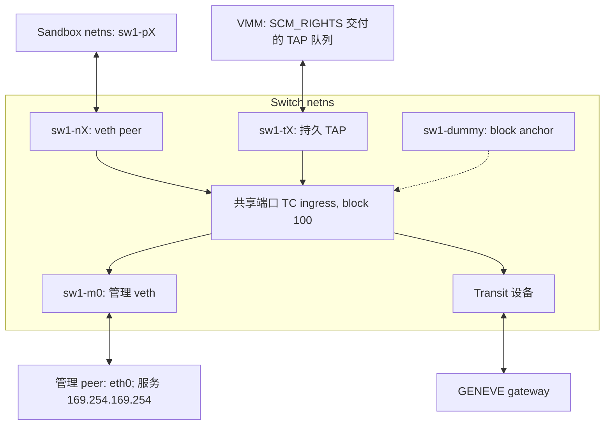
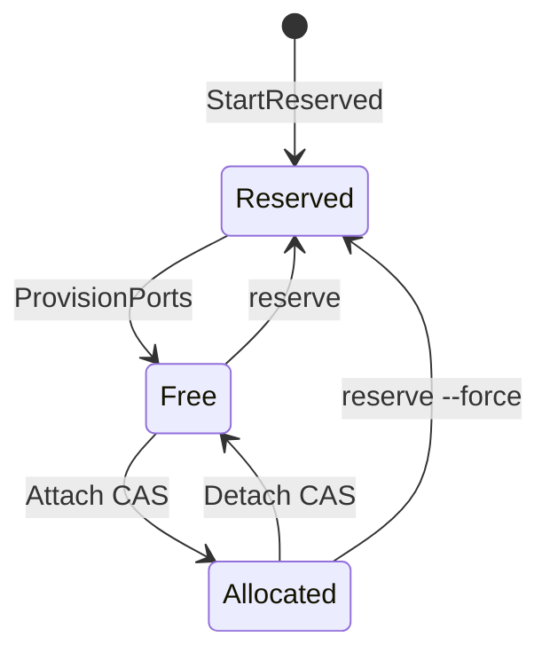
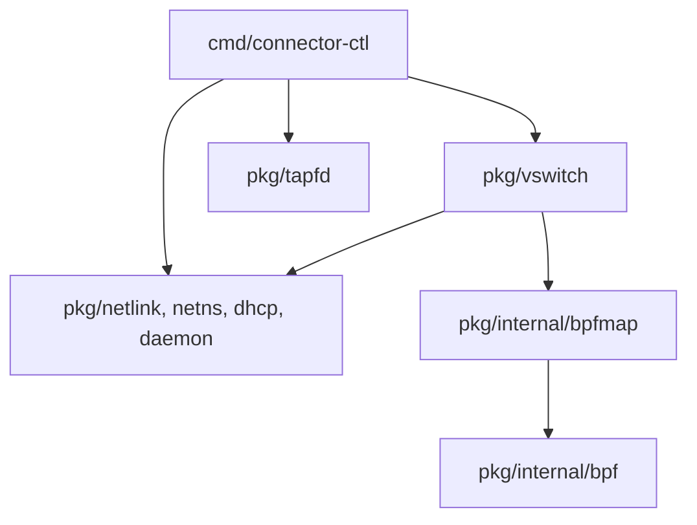

[English](vswitch.md) | [简体中文](vswitch_zh.md)

# vswitch — eBPF 虚拟交换机

基于 eBPF/TC 的虚拟交换机,为单台 Host 上最多 **4096 个已配置沙箱端口**提供管理
与外部网络通道。CLI 为 `connector-ctl vswitch`,同一二进制还提供
`connector-ctl tapfd get`。编译期端口容量不代表任意 Host/负载都能承载 4096 个活跃 MicroVM。

转发由内核 TC ingress eBPF 完成。一次性配置命令可退出,TC 引用、pinned maps
及内核设备维持数据面;`serve` 是常驻控制/健康检查/TAPFD provider,不转发数据包。
slot 定位来自入口 ifindex、floating IP 或 configured GENEVE locator,不把沙箱
自报的源 IP/MAC 当端口身份。程序没有直接 port→port 分支,ARP 由交换机代答,
出口以太网源地址受控。这些局部性质可审计;外部 gateway 与管理服务策略仍是独立边界。

TAP 模式用 SCM_RIGHTS 把队列 fd 交给 Cloud Hypervisor、Firecracker 等 VMM。
完整 provider/consumer 契约见 [tapfd_zh.md](tapfd_zh.md)。

## 1. 概述

### 1.1 业务问题

目标是在单机为数千个 MicroVM 提供网络:内核转发、无需用户态包中继、局部沙箱
隔离、约 4K 端口容量,并把控制进程故障与转发解耦。bridge+netfilter、OVS/OVN
或逐 VM veth 编排都可用于其他设计,但需正确配置隔离、广播、路由和生命周期策略。
本项目选择专用转发模型,不据此声称其他方案必然每端口一条规则或存在已测得的性能劣势。

转发决策集中在 [bpf/switch_kern.c](../bpf/switch_kern.c),控制操作更新 BPF 配置
与设备。eBPF/TC 的收益包括:

- 包转发在内核中完成,没有用户态数据包中继;不保证完整 Guest/VMM/网络路径零拷贝或零上下文切换。
- 程序由 TC 引用保留,map 由 bpffs pin 保留;底层资源完整时,控制进程退出不删除它们。
- 专用转发实现可集中评审,无需把行为分散在 bridge FDB 与多条防火墙链中推理。
- per-CPU 计数器与 bpftool 检查。

### 1.2 设计原则

1. **强隔离**:沙箱间不可见(无 port→port 转发路径);ARP 全代答;MAC 由交换机分配并
   在出口改写。
2. **无状态转发**:不维护连接表,采用 slot 配置和 IP/UDP/GENEVE locator 算术,
   并可选用静态管理服务地址转换。
3. **进程生命周期与数据面解耦**:`start`/`attach`/`detach` 返回后用户态退出,转发由
   内核 eBPF 持续执行。
4. **并发安全**:slot 所有权由 mmap + 原子 CAS 判定;含 `geneve_opts` map 的新 switch
   还用 per-switch flock 串行化 Attach/Detach/Reserve 的复合更新。旧 switch 缺少该 map
   时保持原有 CAS-only 路径。
5. **可观测**:per-port、per-direction、per-class(mgmt/transit)流量计数;状态查询用
   Kubernetes Conditions 风格。
6. **systemd-native**:`Type=notify` 集成,watchdog keepalive,崩溃重启后经 bpffs
   重新挂接。

### 1.3 边界

- 单 transit 上行设备;外部 ECMP/链路绑定由上游网络处理。
- 不做数据面限速/QoS,委托给 VMM、TC qdisc 或 cgroup BPF。
- 不做连接跟踪/NAT 状态表/L7 过滤,只做无状态二层/三层封装与代答。
- 管理平面(`--mgmt-extract`/`--mgmt-service`)在 `start` 时固化,变更需重建交换机。
- `--mgmt-extract` CIDR 只定义流量提取范围;管理接口地址、local route、服务监听与
  相关 sysctl 由部署系统负责。
- `MAX_PORTS = 4096` 在 BPF C 中固定,并与 12-bit slot locator 布局绑定(§6.2)。
- 单机控制面,不做跨宿主机同步;每台宿主一个独立实例。

### 1.4 部署形态



适用于单 Host 的 Firecracker、Cloud Hypervisor、QEMU/KVM 等 MicroVM 平台:
各 VM 需要受控出口,端口数不超过 4096。不承担跨 Host SDN 控制面、细粒度
L4+ 多租户策略管理或连接跟踪/L7 安全网关。


<a id="21-子命令总览"></a>
<a id="210-connector-ctl-vswitch-stats"></a>
<a id="211-connector-ctl-vswitch-show"></a>
<a id="212-connector-ctl-vswitch-dhcp"></a>
<a id="213-connector-ctl-tapfd-get"></a>
<a id="214-配置文件--config"></a>
<a id="22-connector-ctl-vswitch-start--serve"></a>
<a id="23-connector-ctl-vswitch-stop"></a>
<a id="24-connector-ctl-vswitch-attach"></a>
<a id="25-connector-ctl-vswitch-detach"></a>
<a id="26-connector-ctl-vswitch-reserve"></a>
<a id="27-connector-ctl-vswitch-provision"></a>
<a id="28-connector-ctl-vswitch-open-port"></a>
<a id="29-connector-ctl-vswitch-status"></a>

## 2. 命令行接口

操作流程与完整示例见 [vSwitch 运维](vswitch-operations_zh.md#2-命令行与配置参考)；底层设计约束仍由本规范定义。


<a id="31-系统要求"></a>
<a id="32-构建"></a>
<a id="33-systemd-集成"></a>
<a id="34-首次启动"></a>
## 3. 部署

操作流程与完整示例见 [vSwitch 运维](vswitch-operations_zh.md#1-部署与前置条件)；底层设计约束仍由本规范定义。

## 4. 网络架构

### 4.1 拓扑与设备命名



设备命名约定 `<switch-name>-{p,n,m,t}<id>`:`sw1-p7`(沙箱端 veth)/`sw1-n7`(交换机端
veth)/`sw1-m0`(管理端)/`sw1-t7`(持久 tap)。`<sw>-dummy` 是一个无 IP 的 dummy
设备,持有 TC shared block 100 上的 BPF filter 引用(StartReserved 创建、Stop 删除),
让 filter 在所有端口设备都未挂载时仍存活。所有沙箱端设备共用 `ingress_block=100`,
BPF 程序经 `skb->ingress_ifindex` 在程序内部分派 slot。

### 4.2 netns 布局

| netns | 用途 | 包含的设备 |
| --- | --- | --- |
| `netns_switch` | 交换机内部网络 | `<sw>-nX`、`<sw>-mX`、`<sw>-tX`(tap 模式)、`<sw>-dummy`、transit 设备 |
| `netns_ports` | 沙箱端口的初始位置(veth 模式) | `<sw>-pX`,attach 后移入沙箱 netns |
| `netns_mgmt` | 管理服务所在网络 | 管理网卡(如 `eth0`);可省略——mgmt veth peer 留在调用方/主机 netns |
| 沙箱 netns | 沙箱自身 | `<sw>-pX`(veth 模式,从 `netns_ports` 移入) |

### 4.3 数据包流向

`--mgmt-extract` 的 CIDR 写入 slot 目的流量分类条件,不是管理 peer 的接口地址。
Connector 创建 veth、设置 MAC/MTU、拉起、挂 TC、写 extraction 并安装 floating
回程路由。接口地址、local route、服务 listener 和 sysctl 由部署负责,确保目标在
管理 namespace 内本地持有或经路由可达。systemd 示例用 MGMT_ADDRS 显式配址([§1.3](vswitch-operations_zh.md#33-systemd-集成))。

**沙箱 → 管理服务**(如 169.254.169.254):

| 阶段 | 报文/动作 |
|---|---|
| 沙箱与端口入口 | `src=169.254.1.1, dst=169.254.169.254`;veth 经 sw-pX→sw-nX,TAP 经对应 ingress。 |
| TC 管理匹配 | 匹配 mgmt_cidrs,SNAT 源到 floating_ip,增加 mgmt_tx。 |
| 管理 veth 与服务 | sw-mX→管理 eth0;服务看到 floating 源,如 100.100.96.X。 |

**管理服务 → 沙箱**:

| 阶段 | 报文/动作 |
|---|---|
| 管理回程 | `src=169.254.169.254, dst=floating_ip`;eth0→sw-mX。 |
| TC 管理入口 | slot_id=dst-floating_ip_base;DNAT 目的到 inner_ip,目的 MAC 设为选定端口 MAC,增加 mgmt_rx。 |
| 端口交付 | switch 端口→沙箱 veth peer 或 TAP 队列。 |

**回程路由**:发往 floating IP 的回包必须到管理侧 TC 才能 DNAT。start 针对最大
4096 地址 floating 段安装所在 /20 的定向路由,metric=100+index,不替换默认路由:

```text
ip route add <floating_ip_base>/20 dev <mgmt-dev> metric <100+index>
```

floating base 不对齐 /20 时最大段跨两个 /20,两条都装。被路由捕获但不属于实际
floating 范围的地址到达管理设备后,`tc_ingress_mx` 因无匹配 slot 返回 `TC_ACT_OK`,
不执行 sandbox DNAT/redirect;后续由 switch namespace 协议栈及其过滤策略处理,
不是 TC 强制丢包。管理 namespace 留空时,路由位于 caller/Host netns,
仍不替换 Host 默认路由。

**可选管理服务转换**:没有 --mgmt-service 时,extraction 只转换 inner↔floating,
服务目的 IP/端口不变,部署须保证 VIP 可达并正确监听。
`--mgmt-service=<VIP>:<vport>:<targetIP>:<targetPort>` 增加确定性、无状态 TCP/UDP 转换:

| 方向 | 转换与结果 |
|---|---|
| 出向 | 管理匹配后 SNAT inner→floating;forward map 命中则 DNAT VIP:vport→targetIP:targetPort;backend 看到 floating 源。 |
| 入向 | floating 目的定位 slot,DNAT 到 inner_ip;reverse map 命中则 SNAT targetIP:targetPort→VIP:vport;沙箱看到预期服务端点。 |

静态 start 配置形成 mgmt_svc_fwd(`{VIP,vport,proto}`→`{targetIP,targetPort}`)和
mgmt_svc_rev(反向 key/value),使用 hash lookup,无连接跟踪。未命中服务表或非
TCP/UDP 流量走原管理路径。VIP 须匹配 extraction,所有 target IP/port 对全局唯一,
映射仅 IPv4。部署保证 backend 可达;loopback target 需管理设备 route_localnet,
否则内核可能按 martian 丢弃。

**沙箱 → 外部网络**:非管理目的(如 8.8.8.8)进入 port TC 后封装 GENEVE,增加
transit_tx。外层 IPv4 源为 transit_ip、目的为 gateway_ip,UDP 源端口取 inner
五元组 hash;locator 编码零基 slot,opaque options 仅随出向发送。
Ether-over-GENEVE 的 inner 源 MAC 为选定端口 MAC,目的为 transit MAC;
IP-over-GENEVE 没有 inner Ethernet header。transit 设备发往 gateway。

**外部网络 → 沙箱**:gateway 返回满足严格 locator 契约的报文。transit TC 恢复
slot,检查分配、ifindex、外层 gateway 源 IP 与 VNI,解封装,按端口重写目的 MAC,
增加 transit_rx 后交付。

两条不变量:

- slot 身份来自 ingress ifindex、floating 目的算术或 configured locator,不来自沙箱自报源 IP/MAC。
- 回程使用选定的 fixed/derived port MAC,与设备/VMM 接收配置一致。

## 5. 数据面

### 5.1 eBPF 程序挂载点

| 设备 | 挂载点 | 程序 | 功能 |
| --- | --- | --- | --- |
| `<sw>-nX` | TC ingress(shared block 100) | `tc_ingress_nx` | ARP 代答;管理流量提取 + SNAT(含可选 service DNAT);GENEVE 封装;统计 mgmt_tx/transit_tx |
| `<sw>-mX` | TC ingress | `tc_ingress_mx` | ARP 代答;floating→inner DNAT(含可选 service 反向 SNAT);投递;统计 mgmt_rx |
| transit 设备 | TC ingress | `tc_ingress_transit` | GENEVE 解封装;外层源 IP 与 VNI 校验;投递;统计 transit_rx |

GENEVE 内层同时识别 IPv4 与 IPv6(管理平面与 `slot.inner_ip` 为 IPv4)。

### 5.2 Pinned maps(`/sys/fs/bpf/<sw>/`)

| map | 类型 | 规格 | nx | mx | transit | 内容 |
| --- | --- | --- | --- | --- | --- | --- |
| `slots` | ARRAY + MMAPABLE | 4096 × 108 B value(112 B mmap stride) | R | R | R | per-slot 配置;用户态 mmap 后对 `inner_ip` 做原子 CAS 完成分配/释放(§6.3) |
| `config` | ARRAY | 1 × 40 B | R | R | R | `switch_mac`/`n_ports`/`floating_ip_base`/Geneve locator/`geneve_encap_eth`/`transit_nexthop`/`port_mac` |
| `metadata` | ARRAY | 1 × 4096 B | – | – | – | JSON 编码的 `SwitchMetadata`,仅用户态读写;新增字段无需重编译 BPF |
| `stats` | PERCPU_ARRAY | 4096 | W | W | W | per-slot `mgmt_{rx,tx}` + `transit_{rx,tx}` 包/字节计数,沙箱视角;attach 尝试清零(失败不使 attach 失败),detach 保留 |
| `ifindex_to_slot` | HASH | – | R | – | – | 入口 ifindex → slot_id 反查,仅出方向无法用 IP/UDP 推导时使用 |
| `geneve_opts` | ARRAY | 4096 × 68 B | R | – | – | per-slot 完整序列化 opaque options;TLV locator 不存入此 map |
| `mgmt_svc_fwd` | HASH | 静态 service entries | R | – | – | `{VIP,vport,proto}→{targetIP,targetPort}`,每条 service 按 TCP/UDP 各一条 |
| `mgmt_svc_rev` | HASH | 静态 reverse entries | – | R | – | `{targetIP,targetPort,proto}→{VIP,vport}` |

新 switch 即使没有 service 配置也会创建并 pin 两张 service map。入站 slot 定位
使用算术或固定 locator 布局,不需要通用 slot-index hash/TLV 搜索;管理服务转换
仍有独立 hash lookup。

### 5.3 数据面 ABI

直接以字节偏移读写下列 C 结构的 Go 代码全部隔离在 `pkg/internal/`(§11):字段偏移
变动等同 ABI 变更,Go 与 BPF 两侧必须同步。

```c
struct slot_item {                          // 108 字节,cache-line 优化
    // ── cache line 0 (hot path) ─────────────────────────────────
    __u32 ifindex;                          // offset  0
    __u32 inner_ip;                         // offset  4 — 0=Free, 0xFFFFFFFF=Reserved, 其他=Allocated
    __u32 transit_ifindex;                  // offset  8
    __u32 transit_ip;                       // offset 12
    __u32 transit_gateway_ip;               // offset 16
    __u32 transit_geneve_vni;               // offset 20
    __u8  transit_mac[6];                   // offset 24
    __u8  mode;                             // offset 30 — 0=veth, 1=tap(用户态元数据,BPF 不读)
    __u8  geneve_opts_len;                  // offset 31 — 0 跳过 geneve_opts lookup
    __u32 mgmt_cidr_count;                  // offset 32
    struct mgmt_cidr mgmt_cidrs_0;          // offset 36 (20B) — 内联第一条(热路径)
    __u8  _pad_cl0[8];                      // offset 56
    // ── cache line 1 (cold path) ────────────────────────────────
    struct mgmt_cidr mgmt_cidrs_ext[MAX_MGMT_CIDR_EXT]; // offset 64 (40B)
    __u8  _pad_cl1[4];                      // offset 104
};   // 108 字节;mmap 后按 8 对齐 → 112 字节/槽 → 4096 槽 = 448 KiB

struct switch_config {                      // 40 字节
    __u8  switch_mac[6];
    __u16 _pad;
    __u32 n_ports;
    __u32 floating_ip_base;
    __u32 geneve_port_base;
    __u8  geneve_encap_eth;
    __u8  _pad3[3];
    __u32 transit_nexthop;
    __u8  port_mac[6];                      // 全零 → 派生;非零 → 固定
    __u8  _pad4[2];
    __u8  geneve_locator;                   // 0=port,1=vni,2=tlv
    __u8  geneve_tlv_type;                  // 精确 8-bit wire type
    __u16 geneve_tlv_class;
};

struct geneve_opts_value {                  // 68 字节
    __u8  len;                              // opaque wire bytes
    __u8  critical;                         // opaque type 中是否存在 0x80
    __u16 reserved;
    __u8  data[64];                         // option header + opaque data
};

struct slot_stats {                         // per-CPU
    __u64 mgmt_rx_packets, mgmt_rx_bytes;
    __u64 mgmt_tx_packets, mgmt_tx_bytes;
    __u64 transit_rx_packets, transit_rx_bytes;
    __u64 transit_tx_packets, transit_tx_bytes;
};
```

原始 slot.geneve_opts_len 只统计 opaque options,不含自动生成的 8-byte TLV locator;
attach/show JSON 则报告总 wire 长度。slot mmap stride 是 112 bytes,C value 是 108。

程序路径检查 Ethernet、相关 IP/header 与 decap 边界,以及 slot 已分配(inner_ip
既非 Free 也非 Reserved)、ifindex 非零、slot_id<n_ports。**外层 transit IPv4**
要求 ihl==5,不能泛化为全部管理/inner-IP 解析路径。transit 回程还校验 gateway 源 IP 与 VNI。

新 switch 总会创建并 pin `geneve_opts`。为兼容旧 pinned switch,仅当该 pin path 为
ENOENT 时 `Open` 将其视为可选 map(`Maps.GeneveOpts=nil`);其它加载错误仍表示 switch
损坏。旧 config 末尾四字节 padding 全零,自然解释为 `geneve_locator=port`。因此旧
switch 可继续 Open/status/show、空 options Attach、Detach 与 Stop;非空 options 或
vni/tlv locator 必须先 stop 并以新版本重建。本实现不为活动 switch 临时创建 map,
也不替换已挂载 TC program。

## 6. 关键机制

### 6.1 MAC 派生

交换机使用统一 MAC 命名空间,所有 ARP 代答 MAC 和设备 MAC 都从用户提供的
`switch_mac` 派生。派生公式 `SS:SS:SS:SS:BB:LL`:

- byte0..3 = `switch_mac[0..3]`
- **byte4 (BB)** = `((switch_mac[4] ^ 0x80) & 0x80) | (id >> 8)`
- **byte5 (LL)** = `id & 0xFF`

其中沙箱端口 `id = slot_id`(`0x000`–`0xFFF`),管理网卡 `id = 0x7FF0 + mgmt_idx`。
派生 MAC 的 byte4 MSB 始终是 `switch_mac[4]` MSB 的反位,故派生 MAC 与 `switch_mac`
不冲突,无需额外的 byte4 防碰撞约束;输入仍须是部署设备可用的合法 6-byte MAC。
slot_id 高 4 位放在 byte4 低 4 位,正好支撑
4096 端口。Go 与 BPF 按相同公式各自重算,改公式两侧必须同步。

`--port-mac-addr` 决定端口设备 MAC:

| 模式 | 端口 MAC | 适用场景 |
| --- | --- | --- |
| `fixed`(默认) | 按 `slot_id=1` 派生,所有端口共享同一 MAC | 快照恢复:microVM 可落到任意空闲 slot,无需在 VM 内重配网络 |
| `per-port` | 按各自 `slot_id` 派生,每端口唯一 | 测试/需要网关侧按 MAC 区分 |
| 显式 MAC | 用户指定,所有端口共享 | 特殊兼容需求 |

### 6.2 GENEVE 隧道

Connector 部署在沙箱 host,外部 Geneve gateway 负责与外部网络互通。两者只约定
Geneve framing、slot locator 与返程验证;locator 标识零基 `slot_id=0..4095`,不是用户
可见的一基 `port=slot_id+1`。opaque options 的业务含义完全属于调用方与 gateway,
Connector 不定义 policy、sandbox 或 tenant schema,也不解析其 data。

封装模式(解封装按 `geneve->proto_type` 自动识别,无须配置):

| 模式 | `proto_type` | 内层 | 用途 |
| --- | --- | --- | --- |
| **IP-over-GENEVE**(默认) | `ETH_P_IP`/`ETH_P_IPV6` | 裸 IP 报文 | 省 14 字节;适合 vswitch-to-vswitch |
| **Ether-over-GENEVE** | `ETH_P_TEB`(0x6558) | 完整以太网帧 | 兼容标准 Linux GENEVE 设备/网关桥接 |

`geneve_locator` 的 wire contract:

| locator | 出站 UDP dst | 出站 VNI | 自动 locator | configured VNI 范围 | 严格返程 |
| --- | --- | --- | --- | --- | --- |
| `port`(默认) | `geneve_port_base + slot_id` | 完整 `transit_geneve_vni` | 无 | `0..0xffffff` | `OptLen=0,C=0`,由 UDP dst 恢复 slot |
| `vni` | `6081` | `(slot_id << 12) \| transit_geneve_vni` | VNI 高 12 bits | `0..0x0fff` | UDP dst=6081,`OptLen=0,C=0`;高 12 bits 恢复 slot,低 12 bits 校验 VNI |
| `tlv` | `6081` | 完整 `transit_geneve_vni` | 首个 8-byte option | `0..0xffffff` | UDP dst=6081,options 恰为唯一 8-byte locator |

VNI locator 固定采用 12/12 layout:

| VNI bits | 宽度 | 内容 |
|---|---|---|
| 23..12 | 12 | slot_id |
| 11..0 | 12 | transit_geneve_vni |

TLV locator 的 `--geneve-tlv-locator=CLASS:TYPE` 是精确 wire class/type。例如
`0102:81` 中 type 是原始 8-bit `0x81`,包含 critical bit;Connector 不自动设置或
清除 `0x80`。locator wire option 固定为 `Class=configured class`,`Type=configured
type`,`Length=1`,`Data=be32(slot_id)`,总长 8 bytes,且始终排在 options 首位。新定义
可优先选用 critical type,但是否设置 critical bit 由协议双方决定。

完整 attach 命令示例见 [运维 §2.4](vswitch-operations_zh.md#24-connector-ctl-vswitch-attach);以下维护 wire 契约。

class/type/data 均为十六进制;type 同样是精确 8-bit wire value;data 长度必须是 4
字节整数倍,协议合法的零长度写作 `0102:02:`。Connector 保持 option 输入顺序、data
字节序和重复项,不排序、不去重。TLV 模式禁止 opaque option 与 locator 使用相同 class
及相同低 7-bit type,避免 critical bit 不同但逻辑 type 重复。Geneve base `C` 在 locator
或任一 opaque option 的 `type & 0x80 != 0` 时置 1,否则置 0。

全部 wire options 的固定上限是 64 bytes,包含每个 4-byte option header、opaque data
以及 TLV locator 的 8 bytes。因此 port/vni 可使用 64 bytes opaque options;TLV 模式
最多使用 56 bytes opaque options。opaque options 只用于 Connector→gateway 出站;
首期仅能在 Attach 时设置,不支持在线更新,也不回传给 sandbox。

返程采用严格而非通用 TLV parser:port/vni 拒绝任何 option 或 `C=1`;TLV 要求 locator
是第一个且唯一 option,class/type 精确匹配,length=1,data 是范围内 `be32(slot_id)`,
reserved bits 为 0,且 base `C` 与 locator type critical bit 一致。gateway 不得在返程
镜像 opaque options。恢复 slot 后统一校验 slot 已分配、ifindex、gateway source IP 与
configured VNI。

所有模式继续保留 UDP source port 的 inner 5-tuple Jenkins hash,映射到
49152–65535,供底层网络做 ECMP/RSS。未配置 locator 等价 `port`;未配置 opaque options
时,默认 port 模式的 wire packet 与旧版本逐字节相同。

L2 寻址:外层以太网由 `bpf_redirect_neigh` 经内核邻居子系统解析,eBPF 程序不维护
ARP 缓存;内层(仅 Ether-over-GENEVE)目标 MAC 取 `--transit-mac-addr`(未指定则
广播),源 MAC 为派生端口 MAC,与端口设备一致,便于网关侧网桥 L2 学习。

抓包命令与字段检查见 [运维 §3.1](vswitch-operations_zh.md#31-geneve-抓包)。

### 6.3 slot 分配与状态机

并发 attach 下,BPF map 的 Lookup + Update 是两次 syscall,经典 TOCTOU:两个进程同时
读到 slot 空闲,后写者覆盖先写者。解决:`slots` map 启用 `BPF_F_MMAPABLE`,用户态把
整个 array mmap 进进程,对 inner_ip 做 atomic.CompareAndSwapUint32。原子 claim
本身无需锁;新 switch 的复合控制操作还会持有 flock(§6.4)。

| inner_ip | 状态 | 含义 |
|---|---|---|
| 0x00000000 | Free | provision 完成后可分配。 |
| 0xFFFFFFFF | Reserved | 显式 StartReserved/reserve/provision 状态。 |
| 合法真实 inner IPv4 | Allocated | 已 attach。 |



| 操作 | 语义 | CAS |
| --- | --- | --- |
| Attach | Free → Allocated | `CAS(inner_ip, 0, innerIP)` |
| Detach | Allocated → Free | `CAS(inner_ip, currentIP, 0)`;新 switch 在持有 control flock 时清零 hint,map value 留给下一次 Attach 覆盖;不经过 Reserved |
| Reserve | Free → Reserved | `CAS(inner_ip, 0, 0xFFFFFFFF)` |
| Provision 完成 | Reserved → Free | `CAS(inner_ip, 0xFFFFFFFF, 0)` |

失败操作尝试撤销自己的 claim/设备移动,不会覆盖其他 owner。CAS 不等于全部
数据面字段的原子发布,而回滚/设备操作本身也可能失败。调用方应依据操作结果,
在出错后检查并协调实际状态(§7.4)。

### 6.4 控制操作互斥

CAS 只保证单 slot 所有权原子;多 slot/多资源的控制操作,以及新 switch 上跨 mmap slot
与 `geneve_opts` map 的复合更新,经 `flock(LOCK_EX)` 在 bpffs pin 目录
`/sys/fs/bpf/<sw>/` 上互斥:

| 操作 | flock | CAS |
| --- | --- | --- |
| Start(StartReserved) | ✓ | ✓(所有 slot 置 Reserved) |
| Stop / `stop --force` | ✓ | – |
| ProvisionPorts | ✓ | ✓(逐槽 Reserved→Free) |
| Attach / Detach / Reserve(新 switch) | ✓ | ✓;锁覆盖 claim、map/MTU/device 更新与 hint 发布/回收 |
| Attach / Detach / Reserve(旧 switch,无 `geneve_opts`) | – | ✓(兼容的 CAS-only 路径) |

新 switch 的 Attach、Detach、Reserve 在取得 flock 后、执行任何 CAS 前,会把已打开
`slots` map 的 kernel map ID 与当前 pin path 中的 map ID 比较。同名 switch 若在等待锁时
已被 `StopReleased` 并重建,旧 context 会失败并要求重新 Open,不会修改已 unpin 的旧 map。

### 6.5 两阶段启动

为支持 Type=notify 与较早提供控制面入口,启动拆成两阶段。

**阶段 1,StartReserved**:校验配置,加载 BPF 并 pin maps,写 config/metadata;
transit auto 寻址的 DHCP 在该阶段执行。mmap slots 并 CAS 置 Reserved;建立 dummy
block anchor、管理 veth/TC/回程路由并写 service maps;移动、配置并拉起 transit
(MTU/IP)。程序由 TC 引用保留。该阶段包括网络/RTNL 操作,没有普适 100 ms 保证。
此时可以查询 status,但 slot 仍处于 Reserved。

**阶段 2,ProvisionPorts**:逐 Reserved slot 创建 veth pair 或持久 TAP,挂共享
port ingress,写设备/管理/transit 字段,再 CAS Reserved→Free。Free/Allocated
跳过;失败 slot 可用 `provision --port=X` 单点修复。

`serve` 的顺序:

1. StartReserved,或重新 Open 兼容的已存在 switch。
2. 启动可选 TAPFD listener;listener 启动失败不能正常发布 readiness。
3. 发送 sd_notify(READY=1),报告初始 status。
4. 异步 provision 端口。
5. 健康检查、watchdog keepalive,处理 listener/provision 失败与终止信号。
   SIGTERM/SIGINT 退出进程,不拆除 switch 数据面。

依赖服务可在 READY=1 后启动,但必须处理端口暂不可用并重试;systemd 进程就绪
不等于所有端口已经 Free。`Ready` Condition 同样跳过 Reserved slot 的设备检查,
应按 [§2.9](vswitch-operations_zh.md#29-connector-ctl-vswitch-status) 检查容量或目标 slot。Reserved slot 可能在后续未 provision 设备检查之前
就因所有权 CAS 失败而拒绝分配,调用方也须处理这种分配失败。

### 6.6 端口模式:veth 与 tap

每个 slot 在 `slot_item.mode` 记录端口类型。该字段纯属用户态元数据,BPF 数据面不读——
两种模式数据路径完全相同(同样的 TC ingress 程序,同样按 ifindex 路由),差别只在
控制面走哪条 attach/detach/open-port 逻辑。

|  | **veth**(`mode=0`) | **tap**(`mode=1`,CLI 默认) |
| --- | --- | --- |
| 交换机端设备 | `<sw>-nX`(veth 对端) | `<sw>-tX`(持久 tap,`TUNSETPERSIST`) |
| 沙箱端 | `<sw>-pX`(attach 时移入沙箱 netns) | 无设备——沙箱经 `SCM_RIGHTS` 拿 fd |
| `--port-netns` | 必需 | 不需要(tap 留在 switch netns) |
| attach | slot claim/control 更新，并可把 `<sw>-pX` 移入沙箱 netns | slot claim/control 更新；没有已 provision 的 ifindex 时拒绝 |
| detach | 释放 claim，按配置检查/移回 peer；可显式跳过 | 释放 claim，不移动 TAP |
| 取 fd | n/a | `open-port`([§2.8](vswitch-operations_zh.md#28-connector-ctl-vswitch-open-port))或 `attach --open-port` |

模式切换:`provision --mode=<new>` 在 Reserved slot 上先创建新模式设备 → commit 新
`slot.ifindex` → 再删旧模式设备(新旧设备名不冲突,可短暂共存)。

**核心不变量**:attach 和 detach 永远不创建/删除设备(两种模式皆然)。设备生命周期由
`provision`(创建)与 `stop`/`stop --force`(删除)完全拥有;`stop --force-clean` 只
unpin BPF 资源、不删设备。`--skip-device` 控制允许的设备移动/检查，不会把 attach 变为设备 provision 操作。

### 6.7 tap fd 交接

交接遵循 [tapfd_zh.md](tapfd_zh.md) 的厂商无关协议(`SCM_RIGHTS` + NUL 结尾 `key=value`
元数据 + `TAPFD_SOCKET` 获取契约),协议规格独立可读,第三方 VMM 据此即可对接。本节
只记录 connector 作为 provider 实现的具体取舍。

**元数据字段**(tapfd.md §2.3):除必填 fd= 外,发送 mac(选定端口 MAC,须 mirror
到 VMM virtio-net 接收配置)和 ip(真实 inner IP)。slot 分派使用 ifindex,不靠
该 MAC 识别。还附扩展
字段 `port`(1-based slot 编号,仅供诊断,consumer 可忽略):

```
port=1 mac=02:00:00:00:80:01 ip=169.254.1.1 fd=1\0
```

consumer 经 `TAPFD_WANT_NETNS` 请求时(tapfd.md §3.4),在 tap fd 之后追加 switch
netns 的 fd 并置 `netns_fd=1`,供 consumer `setns(2)` 进入该 netns 操作设备本体。

**provider helper 行为**:`open-port` 读 `TAPFD_SOCKET`(`fd=N` 或路径),进入 switch
netns,`open(/dev/net/tun)` + `TUNSETIFF(IFF_TAP|IFF_NO_PI|IFF_VNET_HDR)`——fd 带
virtio-net header,主流 virtio VMM 的预期帧格式;vnet_hdr 是本次 attach 的属性,与
持久设备的创建标志无关。发送后关闭本地 fd 并退出;TUNSETPERSIST 保留设备,
队列仍随 descriptor 引用生灭,后续 consumer 可按 provider 契约请求新交接。
attach --open-port 在 transfer 失败后尝试以 SkipDevice detach,保留已 provision 的
TAP。清理出错时不能保证 slot 干净;重试前应检查/协调状态。复用 slot 前应先停止
并关闭之前的 VM/队列 consumer。

**前置校验**(触碰 socket/tap 之前即拒绝):slot 必须是 tap 类型、已
provision(`ifindex != 0`)、已 attach(inner IP 为真实 IP,故 `ip` 字段总是真实值)。
交换机未运行 → 退出码 `3`。

**接收方**:第三方实现 tapfd.md §2 即可;本仓提供 Go 参考库 `pkg/tapfd`
(`RecvFd`/`RecvFds`/`RecvFdsWithNetns`)与源码树示例 `examples/tapfd_receiver/`。
普通 Unix 字节流 listener 并不等于实现了 SCM_RIGHTS 接收。

### 6.8 MTU 校验

GENEVE 封装增加报文长度,必须保证
`transit_mtu >= port_mtu + base_overhead + wire_options_len`:

| 模式 | overhead |
| --- | --- |
| IP-over-GENEVE | ETH(14) + IP(20) + UDP(8) + GENEVE(8) = **50** |
| Ether-over-GENEVE | 上述 + 内层 ETH(14) = **64** |

上述是实现采用的配置校验 budget。TLV 即使没有 opaque options 也至少多 8 bytes。
**当前两阶段 provision 不把 --mtu 传给新建 TAP/veth 端口**:BPF SwitchConfig 无
MTU 字段,provision 以 kernel defaults 创建设备。请求值用于管理设备与初始 transit
budget 检查;必须读取实际端口 MTU,不能假定 flag 已设置端口。`--transit-dev-mtu`:未指定——不改 transit
MTU,启动时至少校验 fixed locator overhead;`auto`——自动设为
`port_mtu + base_overhead + 64`,保证之后任意合法 Attach 不需调整活动设备;数字——设为
该值并验证 fixed overhead。显式请求值可用于资源创建前的固定 budget 检查;
未给时,Reserved 端口尚不存在,启动使用已发现设备或默认值。请求值可能与之后
的实际端口值不同,不能只依赖初始检查。使用前核对实际 port/transit MTU;部署若
显式修改端口 MTU,还须同步 peer/Guest 配置。接口 MTU 设置也不会扩大物理 underlay。

Attach 的 total wire options 非零时,在移动 veth 或交付 tap fd 前再次读取所选端口与
transit 设备的实际 MTU,按本次总长校验;TLV 模式的固定 8-byte locator 也包含在内。
失败时保持 options hint 为零并尝试释放 CAS claim。错误同时给出 port MTU、transit MTU、
base overhead、options overhead 与 required MTU,例如:

```
transit device eth1 MTU 1570 is too small for port sw0-n1:
  port MTU 1500 + base GENEVE overhead 64 + options overhead 12 = required MTU 1576
```

### 6.9 DHCP 网关推算

`--transit-dev-addr=auto` 时,StartReserved 阶段在 transit 设备 up 之后执行 DHCP:
响应含 Router Option(3)则直接采用;不含网关则推算子网首个可用 IP 作为网关(如
`192.168.1.100/24` → `192.168.1.1`)并打印提示——处理私有 DHCP 服务器只下发 IP 不
下发网关的情况。但推算不证明该地址确有 router;网络不符合该假设时应配置显式 gateway。

## 7. 安全与隔离

### 7.1 威胁模型

Connector 是 MicroVM 外的纵深防御层,VMM 仍是 Guest 的主要隔离边界。沙箱代码
可能恶意;Host 控制调用方、管理服务与外部 gateway 必须受部署策略约束。

| # | 威胁 | 机制与边界 |
|---|---|---|
| T1 | 沙箱伪造源 IP/MAC 作为端口身份 | slot 来自 ifindex、floating 目的或 locator,出口 MAC 受控;不等于对全部 inner 字段实现外网 anti-spoofing 策略。 |
| T2 | 本地直接 sandbox→sandbox 转发 | 无 port→port TC 分支;出向只进入 mgmt/transit,经 gateway/管理服务的访问另需策略。 |
| T3 | 非预期 GENEVE 回程来源 | 校验 gateway 源 IP、locator、VNI;IP/VNI 匹配不是密码学认证,仍需信任 underlay/gateway。 |
| T4 | ARP 广播穿越本地端口 | port ARP request 被交换机消费并回复本端口,不桥接给其他 sandbox。 |
| T5 | 控制进程崩溃导致转发停止 | TC 引用、pins 和完整内核网络资源超越进程生存;serve 可重新 Open(§8.1)。 |
| T6 | 并发 attach 重复分配 | mmap CAS 决定 owner,新 switch 复合操作还持有 flock。 |

### 7.2 隔离不变量

1. **无直接 port→port 路径**:本地程序没有将一个 sandbox ingress 桥接到另一个的分支。
2. **交换机拥有 ARP 回复**:消费端口 ARP request,构造回复交回本端口,不向其他端口广播。
3. **源 MAC 受控**:转发 Ethernet header 使用 switch/选定 port MAC,不把沙箱源 MAC 当 slot 身份。
4. **回程受限**:按 locator 恢复 slot;未分配/无 ifindex、gateway 源 IP 或 VNI 不匹配时,
   不进行 sandbox 解封装/投递。当前不匹配分支返回 `TC_ACT_OK` 给 namespace 协议栈,
   不承诺在 TC hook 丢包。
5. **管理 NAT**:出向源改 floating,入向目的改 inner。该性质指 packet header,不隐藏应用可能写在 payload 中的 IP。

这些是局部数据面性质,不授权任意 gateway/管理 backend 流量,也不代替它们的访问控制。

sandbox 投递与 `TC_ACT_OK` 的区别见
[tc_ingress_mx / tc_ingress_transit](../bpf/switch_kern.c)。namespace 协议栈的
路由/过滤仍由部署负责。

### 7.3 所需权限

特权测试/部署基线是具有所需能力的 root。精确能力裁剪取决于内核、BPF 策略、
namespace 所有权和 pin 文件权限;下表描述相关检查,不是已证明的最小能力集合。

| 操作 | 权限考虑 | 原因 |
|---|---|---|
| start/serve | namespace 进入/设置与旧 BPF 路径需要 CAP_SYS_ADMIN;网络/TC 需要 CAP_NET_ADMIN,现代 BPF 加载还有 CAP_BPF 相关检查。 | 加载、pin、setns、配置 links/TC。 |
| attach/detach/provision/open-port | 相关 namespace/设备权限及 map/pin 访问。 | mmap/CAS、移动/配置设备、打开 TAP 队列。 |
| stop | CAP_NET_ADMIN,以及通常为 CAP_SYS_ADMIN 的 namespace 权限和 map/pin 访问。 | 清理 TC/设备并 setns 移回 transit;CAP_BPF 单独不授权 setns。 |
| status/stats/show | pinned-map 与内核 BPF 访问;namespace/设备检查还可能有额外要求。 | 读 map、检查状态。 |

Linux 5.8+ 将部分 BPF 权限分离到 CAP_BPF,但不替代所有 CAP_SYS_ADMIN 检查。
TC/设备管理仍需对应网络权限。

### 7.4 已知限制

| # | 限制 | 处理 |
|---|---|---|
| L1 | inner_ip CAS 早于全部 transit/options 更新,不是数据面多字段原子事务;没有有界 1µs 窗口或无条件丢包保证。 | 复用前停止/关闭原 consumer,新 consumer 等 attach 成功再使用;失败后核对状态,协议处理暂态丢包。 |
| L2 | detach 前外部销毁 sandbox netns,可能设备已消失但 slot 仍 Allocated。 | 确认旧 consumer 已退出并核对所有权/设备;按剩余状态使用明确的 detach --skip-device 或 forced stop。容量受 MAX_PORTS 限制。 |
| L3 | 物理 transit 故障 | 仅在已有上游冗余时可依赖它;Connector 自身只有单 transit。启动要求 DOWN,防止接管活跃网卡。 |
| L4 | MAX_PORTS=4096 | 扩大容量需同步 BPF/Go 边界和固定 12-bit locator ABI,不只是修改一个常量。 |
| L5 | 宽 extraction CIDR 引入非预期管理流量,slot 合计只容纳三个 CIDR。 | 使用 /32 等窄匹配并检查实际 slots。 |
| L6 | mgmt-service target 不可达,特别是 loopback。 | 校验 VIP/extraction 与 target 唯一性,部署仍需路由/listener/loopback route_localnet。 |
| L7 | 旧 switch 缺 geneve_opts | no-option port 模式继续支持;vni/tlv/opaque 前 stop/recreate,无在线 map/program 迁移。 |
| L8 | --mtu 不传播到新 provision 的 TAP/veth 端口 | 检查实际设备 MTU 与完整 underlay budget(§6.8);初始检查或旧版帮助文字不证明端口值已生效。 |

## 8. 可靠性

### 8.1 资源生命周期与崩溃恢复

| 资源 | 持久化机制 | 控制面进程崩溃后 |
| --- | --- | --- |
| BPF 程序 | TC filter refcount | 保留 |
| BPF maps | bpffs pin `/sys/fs/bpf/<sw>/` | 保留 |
| veth / tap / dummy / transit | 内核 netns | 保留 |
| flock | 进程退出自动释放 | 不阻塞下次 start/stop |

`serve` 崩溃 → systemd `Restart=on-failure` → 新进程 `Open(switchName)` 经 bpffs
重新挂接现有 maps + programs → ProvisionPorts 跳过已 Free/Allocated 的 slot →
继续控制/provider 服务。只有控制进程重启、底层资源完整时,既有转发可继续。
namespace/设备删除、map 损坏、Host 重启或 ABI 不兼容是其他故障,不在此保证内。


### 8.2 故障排除

操作流程与完整示例见 [vSwitch 运维](vswitch-operations_zh.md#3-故障排除)；底层设计约束仍由本规范定义。

<a id="91-数据面2-端口拓扑"></a>
<a id="92-控制面128-端口"></a>
## 9. 性能特征

数据面测量需记录源码/二进制版本、宿主及 Guest kernel、CPU/NUMA 放置、NIC/veth 拓扑、MTU、offload/GRO/GSO、包大小、流数、负载和失败。小包包速与大块 TCP 吞吐衡量不同成本；归因前应区分 BPF、namespace/veth 与隧道开销。

控制面测量需明确 Start/StartReserved/Provision/Attach/Detach/Stop、请求/可用端口数、kernel/RTNL 条件及真实完成信号。就绪由 §6.5 的生命周期顺序与 Conditions 判定，不能依赖固定延迟。

使用下方维护中的测试入口与 [项目性能方法](https://github.com/kuasar-sandbox/kuasar-sandbox/blob/main/docs/perf_zh.md)；缺少固定输入与原始证据的历史数字不构成当前容量或时延基线。

## 10. 测试

### 10.1 分层

| 层 | 文件 | 权限 | 内容 |
| --- | --- | --- | --- |
| 单元 | `*_test.go` | 普通用户 | 纯逻辑;mock 注入 BPF/netlink |
| 集成 | `*_integration_test.go` | root | 真实 eBPF 加载、netlink 操作;`-tags=integration -exec sudo` |
| 端到端 | `test/e2e/*_test.sh` | root | 完整网络拓扑 + 真实包;`setup`/`test`/`teardown`/`all` 子命令 |
| 基准 | `examples/perf_bench.sh`、`examples/start_perf_bench.sh` | root + iperf3 | 数据面吞吐/PPS/RTT(不同端口密度)与控制面 Start 耗时 |

### 10.2 eBPF 三层验证

1. **结构对齐** — `pkg/internal/bpf/*_integration_test.go` 校验 Go ↔ BPF C 结构内存
   布局(偏移、大小、对齐)。
2. **`BPF_PROG_TEST_RUN`** — 直接执行 eBPF 程序,喂入手工构造的报文,断言返回 action
   与输出字节。`BPF_PROG_TEST_RUN` 不易设置 `skb->ingress_ifindex`,对 `tc_ingress_nx`
   经 `ifindex=0 → slot_id` 的 map 项绕过。
3. **真实拓扑** — `test/e2e/*_test.sh` 建立完整网络拓扑,用真实 ping/iperf 验证转发。

### 10.3 e2e 套件

| 脚本 | 覆盖场景 |
| --- | --- |
| `mgmt_isolation_test.sh` | 管理平面连通 + 沙箱间隔离不变量 |
| `geneve_eth_test.sh` | legacy port locator 的 Ether-over-GENEVE 经 Linux gateway bridge |
| `geneve_ip_test.sh` | IP-over-GENEVE 双 switch,由 `run_all.sh` 分别覆盖 port/vni/tlv locator、双向连通与 transit stats |
| `provision_test.sh` | 两阶段启动 + Reserved 修复 + show |
| `tap_test.sh` | tap 模式、open-port、`attach --open-port`、模式切换 |

手工搭建拓扑与生命周期操作统一见维护中的 [vSwitch 运维指南](vswitch-operations_zh.md)。
使用 `attach` 返回的实际分配结果，不按沙箱索引推算端口。

## 11. 内部组织

| 路径 | 职责 |
|---|---|
| cmd/connector-ctl/ | Cobra CLI、JSON 输出/依赖注入,以及 tapfd provider 子命令。 |
| pkg/tapfd/ | 公开协议参考:PortMetadata、OpenTap、SendFd、RecvFd、RecvFds、RecvFdsWithNetns、ConnectUnix、UnixConnFromFd。 |
| pkg/vswitch/ | 公开生命周期 API:context/Open、lifecycle/Start/StartReserved、provision、stop、Attach/Detach/Reserve、Status/Stats、Config/FileConfig、metadata、flock 和 exports。 |
| pkg/netlink/ | 公开 veth/TAP/TC 与批量 netlink 操作。 |
| pkg/netns/ | 公开 namespace enter/move/exec。 |
| pkg/dhcp/ | 公开 DHCP 客户端/服务端。 |
| pkg/daemon/ | 公开 systemd sd_notify。 |
| pkg/internal/bpf/ | 内部 BPF ABI:生成的 cilium/ebpf 绑定、types 与 loader。 |
| pkg/internal/bpfmap/ | 内部 ABI 耦合的 mmap、CAS、stats 与 MAC 派生。 |
| bpf/ | switch_kern.c、common.h、vmlinux.h 等 C 源。 |
| test/e2e/ | 组件套件与 run_all.sh。 |
| examples/ | 运维/基准脚本与 tapfd_receiver 源码示例。 |
| dist/ | systemd 单元/配置模板。 |

直接按字节偏移访问 BPF 结构的代码属于 pkg/internal,字段偏移变动即 ABI 变更。
Go internal 规则只允许 parent pkg 树内的代码导入,不允许 cmd 或任意外部 module。
其余 pkg 包提供预期公开 API。CLI 经 pkg/vswitch/exports.go 重导出的 helper 调用,
与外部嵌入者走同一 API 路径。

依赖方向无环:



pkg/tapfd 除标准库与 golang.org/x/sys 外独立。

## 12. See Also

- [tapfd_zh.md](tapfd_zh.md):完整 provider/consumer fd 交接契约。
- [sandboxer/docs/sandbox_zh.md](https://github.com/kuasar-sandbox/sandboxer/blob/main/docs/sandbox_zh.md):
  sandbox-ctl 经 TAPFD helper 消费网络队列。
- [RFC 8926](https://www.rfc-editor.org/rfc/rfc8926):GENEVE framing。
- [Linux commit fc9702273e2e](https://github.com/torvalds/linux/commit/fc9702273e2edb90400a34b3be76f7b08fa3344b):
  BPF_MAP_TYPE_ARRAY 的 mmap 支持。
- [sd_notify](https://www.freedesktop.org/software/systemd/man/sd_notify.html):systemd Type=notify 集成。
- [cilium/ebpf](https://github.com/cilium/ebpf)、[vishvananda/netlink](https://github.com/vishvananda/netlink):实现使用的 Go 库。
